#+TITLE: clojure-template — 架构设计 (C4 Model, 可执行 org 文档)
#+AUTHOR: clojure-template maintainers
#+DATE: 2026-09-24
#+LANGUAGE: zh-CN
#+OPTIONS: toc:3 num:t ::t |:t ^:nil
#+PROPERTY: header-args :results output :eval never-export
#+PROPERTY: header-args:sh :dir ../..
#+PROPERTY: header-args:clojure :dir ../..
#+STARTUP: showall content
#+EXPORT_FILE_NAME: c4-model-emacs
# ↑ Emacs 的 C-c C-e h h 会导出成 c4-model-emacs.html,不覆盖 build-html.py 生成的 c4-model.html

#+BEGIN_QUOTE
本文是模板项目的架构规范载体(org-mode + org-babel),按 C4 模型自顶向下描述:
System Context(L1)→ Container(L2)→ Component(L3)→ Code(L4),再补充动态视图、部署视图、横切关注点、扩展指南与决策记录(ADR)。

所有 ~#+begin_src~ 代码块都可以执行:
- ~mermaid~ 块由 ob-mermaid 渲染成图(用 flowchart / sequence / ER 记 C4 元素:方框标 ~[Container: 技术]~ ,深蓝=人,蓝=系统/容器,浅蓝=组件,灰=外部;不用 mermaid 实验性的 C4 语法,它在组件数较多时布局会互相压盖),导出 HTML/PDF 时自动生成;
- ~sh~ / ~clojure~ 块是"论断即测试":在仓库根目录 ~C-c C-c~ 直接运行,输出即证据,用来保证文档与代码不脱节。
所有块默认 ~:eval never-export~ :导出 HTML/PDF 时*不*执行任何块(用已缓存的 ~#+RESULTS:~ 图片与代码原文),避免导出时弹出十几次确认、跑几分钟测试;需要刷新证据时在块上 ~C-c C-c~ 手动执行。没有会产生副作用的块(除标 ~:eval never~ 的部署命令)。

*维护约定*:新增业务模块、改动 ~system.edn~ 装配、改动中间件链或路由聚合时,必须同步更新本文对应小节(见第 10 节的清单)。
#+END_QUOTE

* 0. 环境准备(babel 语言)

*直接导出*:本文所有图已预渲染在 ~img/*.svg~ 并以 ~#+RESULTS:~ 链接挂在各 mermaid 块下,文件头设了 ~:eval never-export~ ,所以 ~C-c C-e h h~ 不需要任何 babel 语言、不执行任何代码就能得到带图的 HTML(pandoc 也一样)。

*重新生成图 / 执行证据块* 才需要下面的配置(在 Emacs 里配置一次即可):

#+begin_src emacs-lisp :eval never
;; 1. mermaid-cli:npm i -g @mermaid-js/mermaid-cli,然后 which mmdc 得到路径
(setq ob-mermaid-cli-path "/opt/homebrew/bin/mmdc")   ; 按 `which mmdc` 的结果改;GUI Emacs 的 PATH 常不含 npm 全局目录
;; 2. 让 org-babel 认识 mermaid:装了 ob-mermaid 包还不够,必须 require 或加进 load-languages,
;;    否则导出时报 "No org-babel-execute function for mermaid!",图就不会生成
(require 'ob-mermaid)
(org-babel-do-load-languages 'org-babel-load-languages
                             '((shell . t) (clojure . t) (mermaid . t) (python . t)))
;; 3. clojure 块通过 CIDER(先 cider-jack-in 到本项目的 :dev 别名)或 babashka 执行
(setq org-babel-clojure-backend 'cider)
#+end_src

刷新一张图:光标放在 mermaid 块上 ~C-c C-c~ ,会覆盖 ~img/<名字>.svg~ 并更新 ~#+RESULTS:~ ;刷新全部:~M-x org-babel-execute-buffer~ (会连 sh 证据块一起跑,含约 3 分钟的后端测试)。

不用 Emacs 也可以:把 ~sh~ 块的内容复制到终端执行;mermaid 块可贴到 https://mermaid.live 预览。要生成自包含的 HTML(图内联为 SVG、证据块附上生成时的实际输出),在仓库根目录执行 ~bb docs~ (即 ~python3 docs/architecture/build-html.py~ ;需要 pandoc 与 node,首次会通过 npx 拉取 mermaid-cli),它同时会重写 ~img/*.svg~ ,产物为 ~docs/architecture/c4-model.html~ 。

* 1. 阅读指南

| 层级 | 回答的问题 | 本文小节 |
|------+-----------------------------------------------+----------|
| L1 System Context | 系统给谁用、和哪些外部系统打交道 | §2 |
| L2 Container | 系统由哪些可独立运行/部署的单元组成 | §3 |
| L3 Component | 每个容器内部的主要模块及其职责、依赖 | §4(后端)§5(前端) |
| L4 Code | 关键命名空间、目录约定、一个模块的垂直切片 | §6 |
| Dynamic | 关键场景下组件如何协作(登录、CRUD、导航、启动) | §7 |
| Deployment | 开发/生产环境下容器落在什么基础设施上 | §8 |
| 横切关注点 | 认证授权、审计、双库兼容、配置、热重载、错误处理 | §9 |
| 扩展指南 | ~bb new-module~ 脚手架、手工清单、从模板派生新项目 | §10 |
| 质量保障 | 测试分层、静态检查、规模约束、CI 流水线 | §11 |
| ADR | 为什么这样设计、曾经放弃过什么 | §12 |
| 设计债 | 已知与设计不一致之处、建议的接入方式 | §13 |

* 2. System Context(L1)

模板本身是一个 *单体管理后台*:浏览器中的管理员通过 SPA 操作;后端只依赖一个关系数据库;开发者通过 nREPL 与运行中的系统交互。没有其它必需的外部系统——这正是模板"干净"的含义,业务外部依赖(短信、对象存储、第三方 API 等)由派生项目按需加入,并在此图追加 ~System_Ext~ 。

#+begin_src mermaid :file img/c4-context.svg :exports results
flowchart TB
  admin(["管理员 / 业务用户 [Person] 在浏览器中登录,管理用户、角色、菜单、字典、任务等"]):::person
  dev(["开发者 [Person] 本地运行、nREPL 热重载、bb new-module 生成模块、查看 Swagger"]):::person
  browser["浏览器 [External] Chrome / Edge / Safari,运行 SPA"]:::ext
  subgraph SYS["clojure-template"]
    app["管理后台 [Software System] Clojure(Kit / Integrant / Reitit / Undertow) + ClojureScript(Reagent / re-frame / antd)"]:::system
  end
  db[("关系数据库 [External System] SQLite(默认,单文件)或 MySQL 8")]:::ext
  admin -- 使用 --> browser
  browser -- "HTTPS:静态资源 + REST/JSON(/api/*)" --> app
  dev -- "nREPL :7000 热重载;Swagger UI /api" --> app
  app -- "读写 sys_* 表;启动时自动迁移 [JDBC / HikariCP]" --> db
  classDef person fill:#08427b,stroke:#052e56,color:#fff
  classDef system fill:#1168bd,stroke:#0b4884,color:#fff
  classDef ext fill:#999999,stroke:#6b6b6b,color:#fff
#+end_src

#+RESULTS:

*边界说明*
- 同一个 JVM 进程同时提供 API 与前端静态文件(同端口 3000),不需要独立的 Web 服务器;生产可在前面放 Nginx 做 TLS/反向代理(见 §8)。
- 数据库是唯一的状态存储:会话、验证码、登录失败计数、续期宽限都在数据库( ~sys_online~ / ~sys_kv~ ),多实例部署共享,不引入 Redis;只有 Quartz 调度与缓存监控的演示数据在各实例内存里(见 §9.7)。

* 3. Containers(L2)

#+begin_src mermaid :file img/c4-containers.svg :exports results
flowchart TB
  admin(["管理员 [Person] 浏览器"]):::person
  dev(["开发者 [Person] REPL / 编辑器"]):::person
  subgraph SYS["clojure-template"]
    direction TB
    spa["Web 前端 (SPA) [Container: ClojureScript 1.12, shadow-cljs 3.5, Reagent 2.0, re-frame 1.4, React 19.3, antd 6.6] 登录、布局(侧边菜单 / 多 Tab)、系统管理 / 监控 / 工具页面 编译产物 resources/public/js/app.js"]:::container
    backend["后端服务 (JVM) [Container: JDK 21, Clojure 1.12.6, Kit 1.0, Integrant, Undertow, Reitit 0.11, Ring 1.15] REST API(/api)、静态资源、SPA fallback、Swagger、Quartz 调度 端口 3000"]:::container
    nrepl["nREPL 服务 [Container: kit-nrepl] 开发期热重载入口;端口 7000,仅绑定 127.0.0.1"]:::container
    db[("数据库 [Container: SQLite 文件 ruoyi.db 或 MySQL] sys_user / role / menu / dept / post / dict / config / notice / log / job / online / form_template")]:::container
    fs["本地文件 [Container: 文件系统] 上传目录(通用上传 / 头像)、日志 log/、SQLite 文件"]:::container
  end
  admin -- "访问 [HTTPS]" --> spa
  spa -- "REST/JSON,Bearer JWT [HTTPS]" --> backend
  backend -. "提供 index.html 与 js/css" .-> spa
  dev -- "(user/rd) (user/rr) … [nREPL]" --> nrepl
  nrepl -. 同一 JVM 内 .- backend
  backend -- "conman/HugSQL + Migratus [JDBC]" --> db
  backend -- "读写 [FS]" --> fs
  classDef person fill:#08427b,stroke:#052e56,color:#fff
  classDef container fill:#438dd5,stroke:#2e6295,color:#fff
#+end_src

#+RESULTS:

** 3.1 容器清单与技术选型

| 容器 | 技术 | 入口 / 配置 | 生命周期 |
|------+------+-------------+----------|
| 后端服务 | JDK 21, Clojure 1.12.6, Kit 1.0, Integrant, Undertow, Reitit 0.11, Ring 1.15, Muuntaja 0.6, Malli 0.20, Buddy 3, conman/HugSQL, Migratus, Quartz 2.5, HikariCP 7, sqlite-jdbc 3.53, MySQL Connector/J 26.7 | ~com.ruoyi.core/-main~;装配见 ~resources/system.edn~ | 开发 ~bb dev~ / ~bb backend~ ;生产 ~bb uberjar~ 后 ~java -jar~ (prod 先校验密钥) |
| Web 前端 | ClojureScript 1.12, shadow-cljs 3.5, Reagent 2.0(函数组件 + Hooks), re-frame 1.4, bidi, cljs-ajax, antd 6.6, React 19.3 | ~com.ruoyi.frontend.app/init~;构建见 ~shadow-cljs.edn~ | 开发 ~bb dev~ (watch);生产 ~bb release~ (warning 即失败) |
| nREPL | kit-nrepl(Integrant 组件 ~:nrepl/server~) | ~NREPL_PORT~ / ~NREPL_HOST~ | 随后端启动;生产可通过环境变量改端口/绑定 |
| 数据库 | SQLite(开发默认)/ MySQL 8 | ~JDBC_URL~ + ~MIGRATION_DIR~ | 启动时 ~migrate-on-init?~ 自动迁移 |

** 3.2 可执行:Integrant 组件即容器内的"装配清单"

后端所有可替换的部件都在 ~system.edn~ 里声明,下面这段直接从文件里列出组件 key(应与 §4 的组件图一致):

#+begin_src sh :exports both
grep -E '^\s*:[a-z][a-z0-9.-]*/[a-z-]+' resources/system.edn | sed -E 's/^\s*(:[^ ]+).*/\1/' | sort -u
#+end_src

* 4. Components(L3)— 后端

后端是一条固定的请求管线: ~Undertow → Ring handler → 基础中间件链 → Reitit 路由 → API 公共中间件(协商/异常/认证/按路由数据鉴权/参数校验)→ Controller → Domain Service(Integrant 组件)→ HugSQL query-fn → DB~ 。Controller 只做"请求 ↔ 领域服务"的翻译,领域服务不知道 HTTP。

#+begin_src mermaid :file img/c4-backend-components.svg :exports results
flowchart TB
  DB[("数据库 [Container: SQLite / MySQL]")]:::container
  subgraph WEB["web 层 (com.ruoyi.web)"]
    direction TB
    handler["handler [Reitit ring-handler] 静态资源 · Swagger UI · SPA fallback 路由器(dev 每请求重建)"]:::comp
    mwcore["middleware.core [Ring] wrap-base:ring-defaults + CORS 白名单 + 静态资源 no-cache + operlog(敏感字段打码)+ query-fn 注入 + JSON body"]:::comp
    routes["routes.api + routes.* [Reitit 数据路由] /api 聚合:auth · system · monitor · common · captcha :auth? / :perms 声明 · Malli 参数校验 · Swagger 元数据"]:::comp
    mwfmt["middleware.formats + exception [Muuntaja / Ring] JSON/Transit 协商(JSON 用 infra.json 的 mapper)· 统一异常 → {:code :msg}"]:::comp
    mwauth["middleware.auth [Ring + reitit :compile] wrap-jwt-auth:Bearer JWT · 会话校验即心跳(sys_online) authorize:按路由数据 :auth? / :perms → 401 / 403"]:::comp
    ctrl["controllers.* [Clojure fn] auth(登录 / 续期 / 登出 / 登录页配置)· register · captcha · common(上传校验 · 头像)· health(含 DB)· monitor · job · system/* params/query:查询参数 → 关键字键"]:::comp
  end
  subgraph DOM["领域层 (com.ruoyi.domain)"]
    direction TB
    dsys["domain.system + system/* [Integrant :app.system/*-service] user / role / menu / dept / post / dict / config / log / form-template / online 领域服务"]:::comp
    dperm["domain.system.permission + data-scope [Clojure] 用户 → 启用角色 → 菜单 perms(admin = *:*:*) data_scope 1~5 → 可见部门 / 本人(多角色并集)"]:::comp
  end
  subgraph INFRA["基础设施 (com.ruoyi.infra / integrant)"]
    direction TB
    idb["infra.db + infra.datasource [next.jdbc] detect-db-type · insert-and-get-id! · 分页 SQLite↔MySQL 语法适配 · 连接池热切换"]:::comp
    isec["infra.security + secrets [buddy] bcrypt 哈希 · JWT(jti / iat / exp 秒)签发与解析 prod 启动前校验密钥"]:::comp
    ionl["infra.online [sys_online + infra.kv] 会话即在线记录:心跳 · 续期改挂 jti(旧令牌宽限记在 kv)· 登出/强退删除 · 清理线程(空闲会话 + 过期键)"]:::comp
    iguard["infra.login-guard + infra.files [infra.kv / java.io] 登录失败限流与解锁(多实例共享)· 上传类型/大小校验 · 文件名清洗与防目录穿越"]:::comp
    ikv["infra.kv + clock + json [sys_kv / java.time / jsonista] 带过期的共享键值(验证码 · 限流 · 宽限)· 每次查询注入 :now 本地时间 · 接口时间统一编码"]:::comp
    isch["infra.scheduler + task + cron [Quartz] sys_job 驱动:调度 / 暂停 / 恢复 / 立即执行"]:::comp
    icache["infra.cache [atom] 内存缓存"]:::comp
    itrace["integrant.trace + state [Integrant 包装] 函数组件调用追踪"]:::comp
  end
  subgraph EDGE["Kit edges(第三方组件)"]
    direction TB
    undertow[":server/http [kit-undertow]"]:::comp
    conman[":db.sql/connection · :db.sql/query-fn [kit-sql-conman + HugSQL] HikariCP · resources/sql/*.sql → query-fn"]:::comp
    migratus[":db.sql/migrations [kit-sql-migratus]"]:::comp
    quartz[":cronut/scheduler [kit-quartz]"]:::comp
    nrepl[":nrepl/server [kit-nrepl]"]:::comp
  end
  undertow --> handler --> mwcore --> routes --> mwfmt --> mwauth --> ctrl
  ctrl --> dsys
  ctrl --> isch
  ctrl --> ionl
  ctrl --> isec
  ctrl --> iguard
  ctrl --> icache
  ctrl -- "验证码 take!" --> ikv
  ionl --> ikv
  iguard --> ikv
  ikv -- "sys_kv" --> conman
  mwfmt -. "mapper" .-> ikv
  ctrl -- "数据范围 → SQL 参数 / allows?" --> dperm
  mwauth --> isec
  mwauth --> ionl
  mwauth -- "permitted?" --> dperm
  dperm -- query-fn --> conman
  mwcore -. "operlog 自行解析 Bearer" .-> isec
  dsys -- "query-fn :name params" --> conman
  dsys --> idb
  conman --> DB
  migratus -- DDL --> DB
  isch --> quartz
  itrace -. "set-ring-handler!(追踪开关)" .-> handler
  classDef container fill:#438dd5,stroke:#2e6295,color:#fff
  classDef comp fill:#85bbf0,stroke:#5d82a8,color:#000
#+end_src

#+RESULTS:

** 4.1 请求管线:中间件顺序

~wrap-base~ 用 ~->~ 把中间件层层包裹, *最后包上的最先看到请求* 。按请求进入的顺序(自外向内):

#+begin_src mermaid :file img/backend-pipeline.svg :exports results
flowchart LR
  U[Undertow] --> H["handler/ring (reitit ring-handler)"]
  H --> B["wrap-base(自外向内) 1 wrap-json-body(响应 map→JSON) 2 wrap-query-fn(注入 :components) 3 operlog(计时;响应后写 sys_oper_log,敏感字段打码) 4 wrap-revalidate-static(非 /api 的 GET 加 no-cache) 5 wrap-cors(白名单 Origin 回显,预检 204;默认不加) 6 ring-defaults(params/cookies/session/安全头) 7 env middleware(env.clj,dev 下为空)"]
  B --> R["router/core reitit 路由匹配"]
  R --> RM["API 公共中间件(routes/api.clj route-data) parameters → muuntaja 协商/响应格式化 → exception/wrap-exception(之后的异常 → {:code :msg}) → wrap-jwt-auth(写 :identity) → authorize(路由数据 :auth? / :perms → 401 / 403) → coerce-exceptions → 请求解码 → Malli coerce"]
  RM --> C[controller]
  C --> D[domain service]
  D --> Q["query-fn (HugSQL)"]
  Q --> DB[(DB)]
  R -. 未匹配且非 /api .-> SPA["SPA fallback: 返回 index.html"]
  R -. /api/* 未匹配 .-> N404[404]
#+end_src

#+RESULTS:

要点:
- ~operlog~ 在路由器 *外层*,看不到路由级 ~wrap-jwt-auth~ 写入的 ~:identity~,所以它自己从 ~Authorization~ 头解析 JWT 取操作人(缺失/无效记为 ~anonymous~);只记录 ~/api/*~ 下的非 GET 请求,跳过 ~/api/auth/login~ ~/api/health~;写日志失败只打 warn,不影响业务响应。
- 认证与鉴权挂在 API 顶层、由 *路由数据* 驱动(ADR-010): ~wrap-jwt-auth~ 对所有 ~/api~ 请求解析令牌(有令牌才查会话), ~authorize~ 是 reitit ~:compile~ 中间件,只包装声明了 ~:auth? true~ 或 ~:perms~ 的路由,未声明的匿名接口零开销。 ~/system~ 、 ~/tool~ 、 ~/common~ 路由组与 ~/auth/refresh~ 、 ~/auth/getInfo~ 声明 ~:auth? true~;具体接口在方法上声明 ~:perms "system:user:add"~ (集合表示满足任一,如用户表单的角色/岗位/部门下拉);子路由可用 ~:auth? false~ 覆盖(头像图片)。 ~/api/health~ 、 ~/api/auth/config~ 、 ~/api/auth/login~ 、 ~/api/auth/register~ (默认关闭)、验证码可匿名访问, ~/api/auth/logout~ 不强制登录。
- 鉴权在参数校验 *之前* :未登录 / 无权限的请求先得到 401 / 403,而不是参数错误;异常中间件在认证之外,认证、鉴权、解码抛出的异常同样转成 ~{:code :msg}~ (5xx 不回传异常消息与 ex-data)。
- dev 环境下 ~router/core~ 返回一个每次请求都重新构建路由表的函数,配合 ~(user/rroutes)~ 实现路由热重载;prod 下路由表只构建一次。
- ~ring-defaults~ 的 cookie session 已配置但业务代码不使用 session(API 全靠 Bearer);CSRF 关闭。

可执行:验证中间件包裹顺序与"哪些路由组要求登录"

#+begin_src sh :exports both
sed -n '/defn wrap-base/,/wrap-json-body/p' src/clj/com/ruoyi/web/middleware/core.clj | grep -E "^\s+(\(|wrap|handle|operlog)" 
echo "--- API 公共中间件(顺序即包裹顺序):"
sed -n '/:middleware \[/,/\]}/p' src/clj/com/ruoyi/web/routes/api.clj
echo "--- 要求登录的路由组 / 声明了按钮权限的接口数:"
grep -rn ":auth? true" src/clj/com/ruoyi/web/routes/*.clj
grep -ho ':perms [^ ]*' src/clj/com/ruoyi/web/routes/*.clj | wc -l
#+end_src

** 4.2 可执行:路由清单(从代码里生成,不是手写)

用 Reitit 直接展开 ~routes.api~,输出"方法 路径";改动路由后重跑一遍,把结果与 README 的 API 概览对照。

#+begin_src sh :exports both
clojure -M:dev -e '
(require (quote [com.ruoyi.web.routes.api]) (quote [integrant.core :as ig]) (quote [reitit.core :as r]) (quote [clojure.string :as str]))
(let [route-fn (ig/init-key :reitit.routes/api {:base-path "/api"})
      router   (r/router (route-fn) {:conflicts nil})]
  (doseq [[path data] (r/routes router)]
    (println (format "%-16s %s" (str/join "," (map name (filter #{:get :post :put :delete} (keys data)))) path))))' 2>/dev/null
#+end_src

** 4.3 可执行:领域服务与 Integrant 的对应关系

每个 ~:app.system/*-service~ 组件在 ~domain/system.clj~ 里用 ~defmethod ig/init-key~ 注册;下面列出注册点,应与 §3.2 的组件 key 一一对应:

#+begin_src sh :exports both
grep -n "defmethod ig/init-key" src/clj/com/ruoyi/domain/*.clj src/clj/com/ruoyi/web/*.clj src/clj/com/ruoyi/web/routes/api.clj src/clj/com/ruoyi/integrant/*.clj
#+end_src

* 5. Components(L3)— 前端

前端是标准的 re-frame 单向数据流: ~页面组件 → dispatch 事件 → 事件处理器(更新 app-db / 触发 :api/* 效果)→ api 层发 HTTP → 成功/失败事件写回 app-db → 订阅驱动重渲染~ 。路由用 bidi 匹配 URL,与 ~history.pushState~ 手动集成(不依赖 accountant)。

#+begin_src mermaid :file img/c4-frontend-components.svg :exports results
flowchart TB
  backend["后端 /api [Container: Reitit]"]:::container
  subgraph SPA["com.ruoyi.frontend"]
    direction TB
    app["app [Reagent root] init:initialize-db → 语言与主题加载 → 路由初始化 → 有 token 则 fetch-info → 渲染 ConfigProvider(主题 / 语言)+ antd App(登录页与布局共用)"]:::comp
    cfg["config [常量] app-name / app-subtitle / welcome-text / repo-url / docs-url"]:::comp
    router["router [bidi + popstate] routes 路由表 · page-names · navigate!(pushState)"]:::comp
    db["db [re-frame app-db 初始值] page / tabs / auth / theme / layout-settings + 各领域列表状态"]:::comp
    events["events + events/* [re-frame reg-event-* / reg-fx] core(导航 / 多 Tab) · auth · theme · common · feedback(:api/error) users / roles / depts / posts / dicts / configs / notices(含铃铛) / menus / logs / jobs / monitor / profile / formbuilder"]:::comp
    subs["subs + subs/* [re-frame reg-sub] core · system · monitor · config"]:::comp
    api["api/* [cljs-ajax / fetch] transport(带令牌 · 过半续期 · 401 回登录页 · 其它失败统一 :api/error · 上传 :body · download!) token · errors(纯函数)· 各领域 api"]:::comp
    infra["i18n · storage · perm [纯 cljs] tr(中文原文为键,en-US 词典) localStorage 唯一入口(ruoyi_ 前缀) permitted? / when-allowed(按钮权限)"]:::comp
    antd["antd [r/adapt-react-class] 组件适配 · message 实例 · Form.useForm"]:::comp
    layout["pages.layout + layout/* [Reagent] Sider 菜单(menu-build 按后端菜单树生成) Header + header-tools(菜单搜索 · 通知铃铛)· 多 Tab(tabs) · 面包屑(menu-data) · 页面分发(page-view)"]:::comp
    pages["pages/* [Reagent 函数组件] login · dashboard · user/* · role · menu · dept · post · dict · config · notice · oper_log · login_log · online · job · server · cache · datasource · integrant · swagger · form_builder · file_manager · profile"]:::comp
    comps["components/* [Reagent] page-card · page-search · page-toolbar · pagination · search-input · status-tag · dict-tag · dept-tree-select · icon-picker · form-field/section · action-menu · error-boundary · theme-switcher · layout-settings · right-toolbar"]:::comp
    theme["theme [antd theme 算法] light / dark / compact · 主色 · 字号 · 组件尺寸"]:::comp
  end
  app --> router
  app --> layout
  app --> theme
  app --> infra
  layout --> cfg
  layout --> infra
  layout -- "render-page(page)" --> pages
  pages --> comps
  pages -- "按钮 :perm / when-allowed" --> infra
  pages --> antd
  pages -- dispatch --> events
  pages -- subscribe --> subs
  events --> db
  events -- "reg-fx :api/*" --> api
  events -- ":router/navigate! → pushState" --> router
  subs --> db
  api -- "HTTP JSON,Authorization: Bearer" --> backend
  classDef container fill:#438dd5,stroke:#2e6295,color:#fff
  classDef comp fill:#85bbf0,stroke:#5d82a8,color:#000
#+end_src

#+RESULTS:

** 5.1 关键设计点

- *菜单不写死*:侧边栏由 ~/api/auth/getInfo~ 返回的菜单树(按角色过滤)经 ~layout/menu-build~ 转成 antd items;前端只维护 ~page->menu-key~ 、面包屑、图标这类"路由关键词 → 展示"映射(~layout/menu_data.cljs~)。顶部菜单搜索也只在这棵树里的页面中搜索。
- *按钮权限*: ~getInfo~ 返回的 ~permissions~ 存在 app-db( ~:auth/permissions~ 订阅);工具栏按钮传 ~:perm~ ,其它元素包 ~perm/when-allowed~ ,没有权限就不渲染。只负责显隐,拦截在后端(§9.1)。
- *多 Tab*: ~:navigate~ 事件同时更新 ~:page~ 、激活/新增 Tab(~events/common~ 的 ~activate-page-tab~)、按页面预取数据(~events/core~ 里的 ~fetch~ 表,系统模块用;脚手架生成的业务页面改在组件挂载时 ~use-effect~ 自行加载,不需要登记预取)。
- *局部状态用 Hooks,全局状态用 re-frame*,禁止 ~reagent/atom~ (AGENTS.md 有完整的 antd 6 适配清单)。
- *主题、布局设置、语言、令牌* 都经 ~storage~ 存在 localStorage(键名 ~ruoyi_<名称>~,改名脚本会一并替换)。
- *暗色主题*:组件内联样式的颜色统一用 ~css/app.css~ 里的 ~--app-*~ 变量, ~app.cljs~ 把当前主题写到 ~<html data-theme>~,变量随之切换;antd 覆盖样式只在浅色主题生效。
- *多语言*: ~(i18n/tr "中文原文")~ ,英文界面查 ~en-US~ 词典,没有译文退回中文;菜单名(数据库)、面包屑、Tab 标题在渲染时经 ~tr~ 翻译。切换语言时根组件以语言为 key 整体重新挂载。外壳已国际化,业务页面按需迁移。
- *登录态*: ~api.transport~ 在令牌过了有效期一半时顺带触发 ~:auth/refresh~ (活跃用户不会掉线),任何带令牌的请求收到 401 就触发 ~:auth/session-expired~ 清理状态并回到登录页。
- *失败反馈*:其它失败(403、5xx、网络断开、业务码非 200)由 transport 派发 ~:api/error~ ( ~events/feedback~ ):弹出后端的 ~msg~ (同文案只显示一条)并复位所有模块的 ~:loading?~ ;调用方的 ~on-error~ 只做收尾。

** 5.2 可执行:前端规模速览

#+begin_src sh :exports both
echo "pages:      $(find src/cljs/com/ruoyi/frontend/pages -name '*.cljs' | wc -l)"
echo "components: $(find src/cljs/com/ruoyi/frontend/components -name '*.cljs' | wc -l)"
echo "events:     $(grep -rho 'reg-event-\(db\|fx\)' src/cljs | wc -l)   fx: $(grep -rho 'reg-fx' src/cljs | wc -l)"
echo "subs:       $(grep -rho 'reg-sub' src/cljs | wc -l)"
echo "routes:     $(grep -c '" :' src/cljs/com/ruoyi/frontend/router.cljs)"
#+end_src

* 6. Code(L4)

** 6.1 目录与命名空间约定

| 路径 | 职责 | 约定 |
|------+------+------|
| ~src/clj/com/ruoyi/core.clj~ | 入口;require 所有 edge/domain/routes 以触发 ~ig/init-key~ 注册 | 新组件的命名空间必须在这里 require |
| ~src/clj/com/ruoyi/config.clj~ | 读取 ~system.edn~ (aero: ~#env~ ~#profile~ ~#or~ ~#ig/ref~) | 配置只从环境变量和 profile 注入 |
| ~src/clj/com/ruoyi/infra/*~ | 与业务无关的技术能力 | 不依赖 ~domain~ / ~web~ |
| ~src/clj/com/ruoyi/domain/*~ | 领域服务:输入 map、输出 map,可脱离 HTTP 测试 | 通过 ~{:query-fn :db}~ 上下文访问数据库 |
| ~src/clj/com/ruoyi/web/routes/*~ | Reitit 数据路由 + Swagger 元数据 + Malli 参数 | 每个模块一个文件,在 ~routes/api.clj~ 聚合 |
| ~src/clj/com/ruoyi/web/controllers/*~ | Ring handler: ~(partial ctrl/fn services)~ 形式注入服务 | 只做参数提取、调用服务、组装响应 |
| ~resources/sql/*.sql~ | HugSQL 查询(~-- :name~) | 两库通用语法;写时间用 ~:now~ (自动注入);库特定变体加后缀并在 Clojure 层选择 |
| ~resources/migrations{,-sqlite}/~ | Migratus 迁移 | 两目录同名同步维护 |
| ~env/{dev,prod}/clj/com/ruoyi/env.clj~ | 环境差异(dev 中间件、日志文案) | 通过 ~:extra-paths~ 选择 |
| ~env/dev/clj/user.clj~ | REPL 助手: ~rd rm rroutes ra rr reset-db migrate~ | 新增领域命名空间时加进 ~reload-domain~ |
| ~src/cljs/com/ruoyi/frontend/*~ | 见 §5 | 每个领域: ~api/x.cljs~ + ~events/x.cljs~ + ~pages/x.cljs~ (+ ~subs/~) |
| ~test/clj/com/ruoyi/**~ | clojure.test; ~test_utils.clj~ 提供启动测试系统、ring-mock 请求、登录 token 等 | 文件名 ~*_test.clj~ |
| ~tests/e2e/*.spec.js~ | Playwright | 依赖已启动的后端(3000) |
| ~bb.edn~ 、 ~bb/tasks/*~ | 工程任务(开发、测试、lint、改名、脚手架)与 ~scaffold/~ 代码模板 | 只依赖 babashka,跨平台;路径与命名空间从 ~kit.edn~ 读取 |
| ~scripts/db.clj~ | 数据库重置与迁移往返(JVM 脚本,由 ~bb test:mysql~ / ~bb db:roundtrip~ 调用) | 与应用读取同样的 ~JDBC_URL~ / ~MIGRATION_DIR~ |
| ~.github/~ | CI 工作流与公共 setup 动作 | 只调用 bb 任务 |

** 6.2 一个模块的垂直切片(以「岗位 post」为例)

从数据库到页面,一个功能横跨 8 个文件,这也是新增模块时要照抄的骨架:

#+begin_src mermaid :file img/vertical-slice.svg :exports results
flowchart TB
  subgraph DB["数据"]
    M["migrations*/…-create-sys-post.up.sql 建表 sys_post"]
    S["resources/sql/system.sql -- :name list-posts / create-post! / …"]
  end
  subgraph BE["后端"]
    D["domain/system/post.clj list-posts / create-post! / update-post! / delete-post!"]
    C["web/controllers/system/post.clj list / create / update / delete / export"]
    R["web/routes/system.clj → post-routes 组 :auth? true · 接口 :perms system:post:*"]
    SYS["system.edn :app.system/post-service + :reitit.routes/api :post-service"]
  end
  subgraph FE["前端"]
    A["api/posts.cljs list-posts / create-post / …"]
    E["events/posts.cljs :posts/fetch :posts/create …"]
    P["pages/post.cljs 搜索栏 + 工具栏 + 表格 + 弹窗"]
    RT["router.cljs #quot;system/post#quot; :post layout/menu_data + page_view + events/common"]
  end
  M --> S --> D --> C --> R
  SYS -. 装配 .-> D
  SYS -. 注入 .-> R
  R <-. HTTP .-> A
  A --> E --> P --> RT
#+end_src

#+RESULTS:

** 6.3 可执行:验证垂直切片的文件都在

#+begin_src sh :exports both
for f in resources/migrations-sqlite/202406110007-create-sys-post.up.sql \
         src/clj/com/ruoyi/domain/system/post.clj \
         src/clj/com/ruoyi/web/controllers/system/post.clj \
         src/cljs/com/ruoyi/frontend/api/posts.cljs \
         src/cljs/com/ruoyi/frontend/events/posts.cljs \
         src/cljs/com/ruoyi/frontend/pages/post.cljs \
         test/clj/com/ruoyi/web/controllers/system/post_test.clj \
         tests/e2e/post-crud.spec.js; do
  printf "%-70s %s\n" "$f" "$([ -f "$f" ] && echo OK || echo MISSING)"
done
grep -n '"/post"' src/clj/com/ruoyi/web/routes/system.clj
grep -n ':post ' src/cljs/com/ruoyi/frontend/router.cljs src/cljs/com/ruoyi/frontend/pages/layout/menu_data.cljs
#+end_src

** 6.4 命名空间依赖方向(允许的箭头)

#+begin_src mermaid :file img/ns-deps.svg :exports results
flowchart LR
  core --> web.routes --> web.controllers --> domain --> infra
  web.routes --> web.middleware --> infra
  web.handler --> web.middleware
  domain -. 禁止 .-> web.controllers
  infra -. 禁止 .-> domain
#+end_src

#+RESULTS:

可执行检查: ~infra~ 与 ~domain~ 不得 require ~web~:

#+begin_src sh :exports both
# 只看 require 向量
grep -rnE "\[com\.ruoyi\.web" src/clj/com/ruoyi/infra src/clj/com/ruoyi/domain && echo "VIOLATION" || echo "OK: infra/domain 不依赖 web 层"
#+end_src

** 6.5 数据模型(由迁移文件推导)

21 张 ~sys_ *~ 表,由 ~resources/migrations* /2024061100xx~ 、 ~202406130005~ 与模板新增的 ~20260924000002~ ( ~sys_role_dept~ )、 ~20260924000003~ ( ~sys_kv~ )、 ~20260924000004~ ( ~sys_notice_read~ )建立;通用审计列 ~create_by/create_time/update_by/update_time/remark~,逻辑删除用 ~del_flag~,状态用 ~status~ ('0' 正常 / '1' 停用)。时间列由应用写入本地时间文本 ~yyyy-MM-dd HH:mm:ss~ ( ~:now~ ,见 §9.3),DDL 里的 ~DEFAULT CURRENT_TIMESTAMP~ 只是兜底。

#+begin_src mermaid :file img/data-model.svg :exports results
erDiagram
  sys_dept ||--o{ sys_user : "dept_id"
  sys_dept ||--o{ sys_dept : "parent_id / ancestors"
  sys_user ||--o{ sys_user_role : "user_id"
  sys_role ||--o{ sys_user_role : "role_id"
  sys_role ||--o{ sys_role_menu : "role_id"
  sys_menu ||--o{ sys_role_menu : "menu_id"
  sys_role ||--o{ sys_role_dept : "role_id(data_scope = 2)"
  sys_dept ||--o{ sys_role_dept : "dept_id"
  sys_menu ||--o{ sys_menu : "parent_id"
  sys_user ||--o{ sys_user_post : "user_id"
  sys_post ||--o{ sys_user_post : "post_id"
  sys_dict_type ||--o{ sys_dict_data : "dict_type"
  sys_job ||--o{ sys_job_log : "job_name+job_group"
  sys_user ||--o{ sys_online : "user_name(逻辑关联)"
  sys_user ||--o{ sys_notice_read : "user_id"
  sys_notice ||--o{ sys_notice_read : "notice_id"
  sys_user {
    int user_id PK
    int dept_id FK
    string user_name
    string password "bcrypt"
    string status
  }
  sys_role {
    int role_id PK
    string role_key "admin = 全部权限 *:*:*"
    string data_scope "1 全部 2 自定义 3 本部门 4 本部门及以下 5 本人"
  }
  sys_menu {
    int menu_id PK
    int parent_id
    string menu_type "M 目录 / C 菜单 / F 按钮"
    string path
    string component
    string perms "如 system:user:add,与路由 :perms 对应"
  }
  sys_job {
    int job_id PK
    string invoke_target "ns/fn(args)"
    string cron_expression
    string status
  }
  sys_online {
    string token_id PK
    string user_name
    int last_access_time
  }
  sys_config { int config_id PK }
  sys_notice { int notice_id PK }
  sys_notice_read {
    int user_id PK
    int notice_id PK
    string read_time
  }
  sys_kv {
    string k PK "captcha: / login-fail: / login-lock: / grace:"
    string v
    int expire_at "毫秒"
  }
  sys_oper_log { int oper_id PK }
  sys_login_log { int info_id PK }
  sys_form_template { int id PK }
#+end_src

#+RESULTS:

可执行:表清单与两库一致性

#+begin_src sh :exports both
echo "SQLite:"; grep -h "CREATE TABLE" resources/migrations-sqlite/*.up.sql | sed -E 's/CREATE TABLE (IF NOT EXISTS )?//; s/ *\(.*//' | sort | tr '\n' ' '; echo
echo "MySQL: "; grep -h "CREATE TABLE" resources/migrations/*.up.sql        | sed -E 's/CREATE TABLE (IF NOT EXISTS )?//; s/ *\(.*//' | sort | tr '\n' ' '; echo
#+end_src

** 6.6 API 约定(前后端契约)

| 约定 | 内容 | 出处 |
|------+------+------|
| 响应信封 | 一律 ~{:code 200 :msg "操作成功" :data …}~;业务失败 ~{:code 500 :msg "…"}~ (HTTP 仍 200);未登录 ~401 {:code 401}~;无权限 ~403 {:code 403}~;coercion 失败由 reitit 返回 400 | 各 controller 的 ~ok~ / ~fail~; ~middleware.auth~ |
| 列表响应 | 分页接口 ~:data {:total n :rows [...]}~;树/全量接口 ~:data [...]~ 。前端 ~:xxx/set-list~ 同时接受两种形状 | ~controllers/system/user.clj~ ~list-users~; ~events/posts.cljs~ |
| 分页参数 | 查询串 ~page~ / ~size~ (不是 pageNum/pageSize);后端转成 ~:page-num~ / ~:page-size~ → SQL ~LIMIT :page_size OFFSET :offset~ | AGENTS.md 第 11 条; ~infra.db/paginate-query~ |
| 路径参数 | ~/:id~ 用 Malli ~PathId~ 校验为数字串,controller 再 ~parse-long~ | ~routes/system.clj~ |
| 认证头 | ~Authorization: Bearer <jwt>~;JWT claims = ~{:user-id :user-name :roles(角色 id 列表) :exp}~,默认 24h | ~infra.security~; ~api/transport.cljs~ |
| 字段命名 | 数据库与 JSON 均 snake_case(~user_name~),Clojure 内部关键字保持 ~:user_name~,不做 camelCase 转换 | 全部 controller / events |
| 时间 | 字符串 ~yyyy-MM-dd HH:mm:ss~ (SQLite TEXT / MySQL TIMESTAMP 均按字符串读写) | 迁移文件 |
| Swagger | 每个路由带 ~:summary~ / ~:description~ / ~:parameters~; ~/api/swagger.json~ + ~/api~ UI | ~routes/api.clj~ |

可执行:抽查响应信封(需后端已在 3000 运行)

#+begin_src sh :exports code :eval never
TOKEN=$(curl -s -X POST localhost:3000/api/auth/login -H 'Content-Type: application/json' \
  -d '{"username":"admin","password":"admin123"}' | python3 -c 'import sys,json;print(json.load(sys.stdin)["data"]["token"])')
curl -s "localhost:3000/api/system/user?page=1&size=1" -H "Authorization: Bearer $TOKEN" | head -c 120; echo
curl -s  localhost:3000/api/system/user            # 期望 {"code":401,"msg":"未登录或令牌已过期"}
#+end_src

* 7. Dynamic Views(动态视图)

** 7.1 登录、续期与会话失效

#+begin_src mermaid :file img/dyn-login.svg :exports results
sequenceDiagram
  autonumber
  participant B as 浏览器(login 页)
  participant E as events/auth + api.transport
  participant API as /api/auth
  participant C as controllers/auth
  participant G as infra.login-guard
  participant S as infra.security
  participant O as infra.online
  participant DB as DB
  B->>API: GET /auth/config
  API-->>B: {captchaEnabled, registerEnabled, demoAccount?(仅 dev/test)}
  opt 开启验证码
    B->>API: GET /captcha/image?r=uuid(验证码存 sys_kv,5 分钟有效)
  end
  B->>E: dispatch [:auth/login {username password captcha? uuid?}]
  E->>API: POST /auth/login
  API->>C: login
  C->>C: 验证码(开启时必填,提交即作废)
  C->>G: locked-until?(按用户名)
  C->>DB: find-user-by-name
  C->>S: verify-password(bcrypt,用户不存在也校验一次假哈希)
  alt 失败
    C->>G: record-failure!(达到上限锁定)
    C-->>E: {code 400/429,"用户名或密码错误" / 已锁定}
  else 成功
    C->>O: register!(jti, user, ip) → sys_online
    C->>S: generate-token(user-id, user-name, role-ids, jti)
    C-->>E: {code 200, data {token expiresIn}}
  end
  E->>E: :auth/login-success → storage :token
  E->>API: GET /auth/getInfo(每个请求:wrap-jwt-auth 校验签名与 exp,再用 jti 心跳 sys_online)
  API-->>E: {user, roles, permissions, menus}
  Note over E,API: 令牌过了有效期一半时,下一个请求顺带 POST /auth/refresh: 会话改挂到新 jti,旧令牌 30 秒宽限后失效
  Note over E,API: 登出 / 强退 / 空闲 30 分钟 → 会话行被删 → 下一个请求 401 → :auth/session-expired → 回到登录页
#+end_src

#+RESULTS:
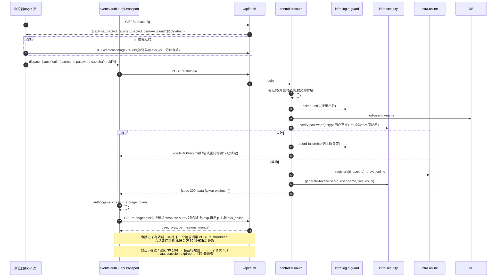

** 7.2 一次受保护的写请求(含审计)

以「新增岗位」为例(路由声明 ~:perms "system:post:add"~)。岗位不按部门归属,数据范围不参与;用户管理的读写会在 controller 里再按数据范围过滤 / 校验(§9.1)。

#+begin_src mermaid :file img/dyn-crud.svg :exports results
sequenceDiagram
  autonumber
  participant SPA as pages/post + events/posts
  participant BASE as wrap-base (json-body / query-fn / operlog / CORS / ring-defaults)
  participant AUTH as API 公共中间件 (协商 · 异常 · wrap-jwt-auth · authorize)
  participant RD as 请求解码 + Malli
  participant CTRL as controllers/system/post
  participant SVC as domain/system/post (:app.system/post-service)
  participant DB as DB (sys_post / sys_oper_log)
  SPA->>BASE: POST /api/system/post (Bearer, JSON)
  BASE->>AUTH: 路由匹配(路由数据 :auth? true · :perms "system:post:add")
  AUTH->>DB: 会话心跳 sys_online · 查用户权限(角色 → 菜单 perms)
  alt 未登录 / 缺少权限
    AUTH-->>SPA: 401 / 403 {:code :msg}(前端回登录页 / 统一提示)
  end
  AUTH->>RD: request 带 :identity {user-id user-name roles jti}
  RD->>CTRL: JSON body → :body-params · 参数已校验
  CTRL->>SVC: create-post! ctx params
  SVC->>DB: INSERT sys_post · insert-and-get-id!
  DB-->>SVC: 新 id
  SVC-->>CTRL: 结果
  CTRL-->>BASE: {:code 200 :msg "操作成功" :data "创建成功: 5"}
  BASE->>DB: operlog:解析 Bearer 取操作人 → INSERT sys_oper_log(uri / 参数 / 状态 / 耗时)
  BASE-->>SPA: JSON 响应 → :posts/fetch 刷新列表 + antd message
#+end_src

#+RESULTS:
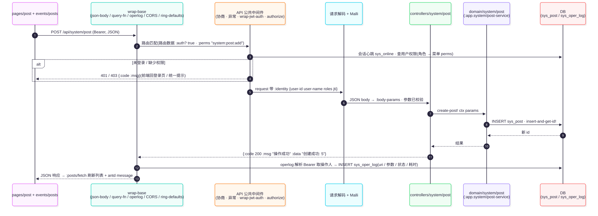

** 7.3 前端导航(URL ↔ 页面 ↔ Tab)

#+begin_src mermaid :file img/dyn-nav.svg :exports results
sequenceDiagram
  participant U as 用户
  participant L as layout(菜单/Tab)
  participant EV as events/core
  participant R as router
  participant P as page-view
  U->>L: 点击菜单 system/post
  L->>EV: dispatch [:navigate :post]
  EV->>EV: activate-page-tab(新增/激活 Tab)
  EV->>EV: 按 fetch 表 dispatch [:posts/fetch {}]
  EV->>R: :router/navigate! → history.pushState("/system/post")
  R-->>P: 订阅 :page 变化 → render-page :post → [post/post-page]
  U->>R: 浏览器后退(popstate)
  R->>EV: dispatch [:navigate <匹配到的页面>]
#+end_src

#+RESULTS:
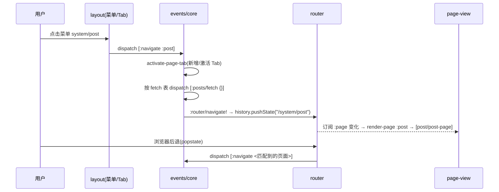

** 7.4 后端启动顺序(Integrant 拓扑)

#+begin_src mermaid :file img/dyn-startup.svg :exports results
flowchart LR
  env[":system/env (profile)"] --> conn[":db.sql/connection HikariCP"]
  conn --> mig[":db.sql/migrations migrate-on-init?"]
  conn --> qf[":db.sql/query-fn 加载 sql/*.sql"]
  qf --> svc[":app.system/*-service"]
  conn --> svc
  mig --> job[":app.system/job-scheduler 从 sys_job 加载任务"]
  qz[":cronut/scheduler Quartz"] --> job
  svc --> api[":reitit.routes/api"]
  api --> routes[":router/routes (refset :reitit/routes)"]
  routes --> rc[":router/core"]
  rc --> ring[":handler/ring"]
  ring --> http[":server/http Undertow :3000"]
  nrepl[":nrepl/server :7000"]
#+end_src

#+RESULTS:

Integrant 按 ~#ig/ref~ 依赖自动排序; ~:app.system/job-scheduler~ 显式依赖 ~:db.sql/migrations~ 是为了保证 ~sys_job~ 表已存在。停止顺序相反(~ig/halt!~)。

* 8. Deployment(部署视图)

#+begin_src mermaid :file img/c4-deployment.svg :exports results
flowchart LR
  subgraph DEV["开发机(macOS / Linux / Windows)"]
    direction TB
    subgraph JVM1["JVM:bb dev → clojure -M:dev -m com.ruoyi.core"]
      be1["后端 + nREPL 3000 / 7000 静态文件直接读 resources/public"]:::container
    end
    subgraph NODE["Node.js:bb dev → shadow-cljs watch app"]
      fe1["shadow-cljs 编译器 增量编译 → resources/public/js"]:::container
    end
    sqlite[("ruoyi.db SQLite 文件")]:::container
    be1 -- JDBC --> sqlite
    fe1 -. 写入 js/ .-> be1
  end
  subgraph PROD["生产主机 / 容器(Linux, JDK 21)"]
    direction TB
    subgraph NGINX["Nginx(可选)"]
      rp["reverse proxy TLS 终止 443 → 3000"]:::container
    end
    subgraph JVM2["JVM:java -jar ruoyi-standalone.jar"]
      be2["uberjar(含前端 release 产物) PORT / JDBC_URL / MIGRATION_DIR 由环境变量注入 JWT_SECRET / COOKIE_SECRET 必填(启动校验)"]:::container
    end
    rp -- HTTP --> be2
  end
  subgraph DBHOST["数据库服务器"]
    mysql[("MySQL 8 myapp (utf8mb4)")]:::container
  end
  be2 -- "JDBC / HikariCP" --> mysql
  classDef container fill:#438dd5,stroke:#2e6295,color:#fff
#+end_src

#+RESULTS:

** 8.1 环境变量一览

| 变量 | 默认 | 说明 |
|------+------+------|
| ~PORT~ / ~HTTP_HOST~ | 3000 / 0.0.0.0 | HTTP 监听 |
| ~NREPL_PORT~ / ~NREPL_HOST~ | 7000 / 127.0.0.1 | nREPL |
| ~JDBC_URL~ | ~jdbc:sqlite:ruoyi.db~ | 换 MySQL 时填 ~jdbc:mysql://…~ |
| ~MIGRATION_DIR~ | 按 ~JDBC_URL~ 推导 | MySQL → ~migrations~ ,其它 → ~migrations-sqlite~ ( ~config/with-default-migration-dir~ );一般不用设 |
| ~JWT_SECRET~ | 内置开发值 | prod 必填:≥32 字符且不等于内置值,否则拒绝启动(~infra/secrets.clj~);生成: ~openssl rand -hex 32~ |
| ~COOKIE_SECRET~ | 内置开发值 | prod 必填:恰好 16 字节(AES-128 cookie store)且不等于内置值;生成: ~openssl rand -hex 8~ |
| ~CAPTCHA_ENABLED~ | prod ~true~ ,dev/test ~false~ | 登录验证码;开启后空验证码判失败 |
| ~TOKEN_TTL_MINUTES~ | 720 | 令牌有效期;活跃用户在过半时自动续期 |
| ~LOGIN_MAX_FAILURES~ / ~LOGIN_LOCK_MINUTES~ | 5 / 10 | 登录失败限流 |
| ~REGISTER_ENABLED~ | ~false~ | 自助注册开关 |
| ~CORS_ORIGINS~ | 空 | 允许跨域的来源,逗号分隔;空 = 只允许同源 |
| ~UPLOAD_MAX_MB~ | 10 | 单个上传文件的大小上限(头像另限 2MB) |
| ~UPLOAD_EXTENSIONS~ | 空 = 内置白名单 | 允许上传的扩展名,逗号分隔(内置白名单见 ~infra.files/default-extensions~ ,不含可执行文件与 HTML/SVG) |

test profile 使用独立端口 3100 / 7100 与独立的 ~test.db~ ,所以 ~bb test~ 可以和正在运行的 ~bb dev~ 并存; ~bb test:mysql~ / ~bb db:roundtrip~ 读取同样的 ~JDBC_URL~ / ~MIGRATION_DIR~ 。认证相关的值汇总在 ~system.edn~ 的 ~:reitit.routes/api :auth-config~ ,上传限制在同一处的 ~:upload-config~ 。健康检查 ~/api/health~ 会执行 ~SELECT 1~ ,数据库不可用时返回 503,可直接用作负载均衡 / 容器编排的探针。本地 MySQL 用仓库根目录的 ~docker-compose.yml~ (mysql:8.4,端口 3308)。

可执行:prod 密钥校验的规则(不启动系统,直接调用校验函数)

#+begin_src sh :exports both
clojure -M:dev -e "(require '[com.ruoyi.infra.secrets :as secrets]) (run! println (secrets/problems {})) (println '---) (run! println (secrets/problems {\"JWT_SECRET\" \"short\" \"COOKIE_SECRET\" \"0123456789abcdef\"}))" 2>&1 | grep -v '^Picked up'
#+end_src

** 8.2 可执行:构建生产包

#+begin_src sh :exports code :eval never
bb uberjar                          # = bb release(前端压缩,warning 即失败)+ clojure -T:build all(clean → pom → 复制 → 编译 → uberjar)
ls -la target/*-standalone.jar
JWT_SECRET=$(openssl rand -hex 32) COOKIE_SECRET=$(openssl rand -hex 8) java -jar target/ruoyi-standalone.jar
docker build -t clojure-template .  # 先 bb release;多阶段:clojure:temurin-21-tools-deps 构建 → eclipse-temurin:21-jre-alpine 运行
docker run -e JWT_SECRET=… -e COOKIE_SECRET=… -p 3000:3000 clojure-template
#+end_src

* 9. 横切关注点

** 9.1 认证与授权
- *身份*:登录成功签发 JWT(~infra.security/generate-token~,claims 含 user-id / user-name / roles(角色 id)/ jti(会话 ID)/ iat / exp(Unix 秒,默认 720 分钟,~TOKEN_TTL_MINUTES~)),前端经 ~storage~ 存在 localStorage 并以 ~Authorization: Bearer~ 发送。
- *会话*:令牌可验签不等于会话有效—— ~wrap-jwt-auth~ 用 ~jti~ 更新 ~sys_online~ 心跳,更新 0 行即视为未登录。登出与强退删除会话行,令牌立即失效(存在数据库里,多实例同样生效);后台线程每 5 分钟删除空闲超过 30 分钟的会话。续期( ~/api/auth/refresh~ )把会话改挂到新 ~jti~,旧令牌记 30 秒宽限( ~infra.kv~ 的 ~grace:<jti>~ ,多实例共享),避免与续期并发的请求被误判。
- *登录保护*:验证码开关( ~CAPTCHA_ENABLED~ ,prod 默认开,开启后空验证码判失败);同一用户名 10 分钟内失败 5 次锁定 10 分钟( ~infra.login-guard~ ,计数与锁存在 ~infra.kv~ ,不存在的用户名同样计数);验证码同样存 ~infra.kv~ ,5 分钟有效、校验一次即作废;失败提示统一为「用户名或密码错误」,用户不存在时也做一次 bcrypt 校验,响应时间一致;自助注册默认关闭,开启后只接受用户名与密码,新用户不带任何角色。
- *功能权限(按钮级)*:路由用数据声明 ~:auth? true~ (要求登录)与 ~:perms~ (字符串或集合,满足任一); ~web.middleware.auth/authorize~ 是 reitit ~:compile~ 中间件,编译期只包装有声明的路由,运行期未登录 401、缺权限 403。权限集合由 ~domain.system.permission/user-permissions~ *每次请求实时* 计算:用户 → 启用的角色( ~status = '0'~ )→ 角色勾选的菜单/按钮( ~sys_menu.perms~ ,可用逗号写多个,停用菜单不计);角色键 ~admin~ 直接得到通配 ~*:*:*~ 。改角色菜单、停用角色立即生效,无需重新登录;代价是每个受保护请求多一次查询(与会话心跳同量级,需要时可加短时缓存)。 ~getInfo~ 返回同一份 ~permissions~,前端据此隐藏按钮( ~toolbar-button :perm~ 、 ~perm/when-allowed~ )——前端只管显隐,拦截以后端为准。每个接口的标识都登记成按钮菜单(F),迁移 ~20260924000001-add-button-perms~ 补齐了各模块的按钮并新增「文件管理」菜单, ~bb new-module~ 生成的模块同样带 ~biz:<模块>:list/query/add/edit/remove~ 。
- *数据权限*:角色 ~data_scope~ (1 全部 / 2 自定义部门,存 ~sys_role_dept~ / 3 本部门 / 4 本部门及以下 / 5 仅本人)由 ~domain.system.data-scope~ 计算成可见范围 ~{:all? true}~ 或 ~{:dept-ids #{..} :self-id ..}~,多个角色取并集,admin 或任一「全部」不过滤;下级部门按 ~parent_id~ 遍历(不依赖 ~ancestors~ 字段)。查询时转成固定的 SQL 参数( ~:scope_all~ ~:scope_dept_ids~ ~:scope_user_id~ ),SQL 里写死 ~AND (:scope_all = 1 OR u.dept_id IN (:v*:scope_dept_ids) OR u.user_id = :scope_user_id)~ ,不拼接 SQL 字符串,两库通用。已接入用户管理:列表与导出按范围过滤;详情、修改、删除、改状态、重置密码、分配角色先检查目标用户在范围内,新增 / 修改时目标部门也必须在范围内,否则 403。部门、角色等其它列表不做数据过滤(与若依的默认一致,需要时照用户管理的写法接入)。

可执行:声明了按钮权限的接口数、登记为按钮菜单的标识数、接入数据范围的 SQL

#+begin_src sh :exports both
echo "路由中的 :perms 声明数: $(grep -rho ':perms [^ ]*' src/clj/com/ruoyi/web/routes | wc -l)"
echo "迁移里登记的按钮菜单(F)数: $(grep -ho "'F', '0', '0', '[a-z:A-Z]*'" resources/migrations-sqlite/*.sql | wc -l)"
echo "SQL 中使用数据范围参数的查询: $(grep -c ':scope_all' resources/sql/system.sql)"
echo "前端按权限显隐的位置: $(grep -rho 'perm/when-allowed\|:perm \"' src/cljs | wc -l)"
#+end_src

** 9.2 审计
~middleware.operlog~ 记录所有 ~/api~ 非 GET 请求(操作人、URL、参数、状态码、耗时)到 ~sys_oper_log~ 。它挂在路由器外层,拿不到路由级中间件写入的 ~:identity~,所以自己解析 ~Authorization~ 头取操作人(模板修复前一律记成 ~anonymous~)。登录成功/失败写 ~sys_login_log~;前端"日志管理"页面查询与导出。

** 9.3 双库兼容(SQLite / MySQL)
- 两套迁移目录同名同步;DDL 差异(自增、时间类型)分别处理。
- 共用 SQL 只用两库都支持的语法(~INSTR~ 代替 ~||~ 拼接, ~LIMIT :size OFFSET :offset~)。
- 函数名不同(~last_insert_rowid()~ vs ~LAST_INSERT_ID()~)提供命名变体,由 ~infra.db/detect-db-type~ 在 Clojure 层选择;元数据查询(~PRAGMA~ / ~information_schema~)也在 Clojure 层分支。
- *时间由应用生成*:SQLite 的 ~CURRENT_TIMESTAMP~ 是 UTC、MySQL 是会话时区,所以共用 SQL 一律写 ~:now~ ; ~infra.clock/with-now~ 包在 query-fn 外层,每次调用自动注入 JVM 默认时区的本地时间( ~yyyy-MM-dd HH:mm:ss~ ,调用方传了 ~:now~ 则不覆盖)。 ~bb lint:migrations~ 禁止 ~resources/sql~ 里出现 ~CURRENT_TIMESTAMP~ / ~NOW()~ / ~datetime(~ / ~||~ 。
- *接口里的时间统一编码*:MySQL 驱动返回 ~Timestamp~ / ~java.time~ 对象,SQLite 返回文本; ~infra.json~ (jsonista,muuntaja 与兜底响应共用)把各种时间类型都编码成本地 ~yyyy-MM-dd HH:mm:ss~ (日期 ~yyyy-MM-dd~ ),前端在两库上拿到的一样。
- ~infra.datasource~ 让连接池可在运行时热切换,用于"连接池监视/数据源切换"演示与测试(换库后按 query-fn 实际加载的 SQL 文件清单重新绑定)。

可执行:两套迁移目录必须成对:

#+begin_src sh :exports both
diff <(ls resources/migrations-sqlite | sed 's/\.\(up\|down\)\.sql$//' | sort -u) \
     <(ls resources/migrations        | sed 's/\.\(up\|down\)\.sql$//' | sort -u) \
  && echo "OK: 两套迁移同名同步"
#+end_src

** 9.4 配置注入
~system.edn~ 是唯一装配点: ~#profile~ 区分 dev/test/prod, ~#env~ 读环境变量, ~#or~ 给默认值, ~#ig/ref~ 声明依赖。业务代码里不直接读环境变量(仅 ~infra.security~ 读 ~JWT_SECRET~ ; ~core/start-app~ 在创建任何组件之前调用 ~infra.secrets/verify!~ ,prod 下密钥不合格直接失败, ~-main~ 打印原因后以退出码 1 结束),测试通过 ~{:profile :test}~ 起一套独立系统(~test_utils.clj~)。

** 9.5 热重载
~env/dev/clj/user.clj~ 提供 ~rd~ (领域) ~rm~ (中间件) ~rroutes~ (路由,需 ~rr~ 生效) ~ra~ (全部) ~rr~ (Integrant halt → prep → go) ~reset-db~ ~migrate~;SQL 文件、 ~system.edn~ 、组件结构变更需要 ~rr~ 。前端由 shadow-cljs watch 增量编译并热加载(~:after-load app/reload~)。

** 9.6 错误处理与安全头
- ~middleware.exception~ 把未捕获异常统一转成与控制器相同的 ~{:code :msg}~ :4xx(业务异常、未找到、未登录、无权限)用异常消息作提示并附 ~ex-data~ ,5xx 一律「服务器内部错误,请稍后重试」且不回传 ~ex-data~ ;coercion 错误由 reitit 的 ~coerce-exceptions-middleware~ 返回 400。
- ring-defaults:XSS 保护、 ~X-Frame-Options: sameorigin~ 、 ~nosniff~;CSRF 关闭(纯 Bearer API)。
- CORS:默认不加任何 CORS 头(前后端同源部署不需要); ~CORS_ORIGINS~ 列出的来源才回显 ~Access-Control-Allow-Origin~ 并直接应答预检, ~*~ 表示任意来源(只建议开发时用)。
- 静态资源:非 ~/api~ 的 GET 响应加 ~Cache-Control: no-cache~,浏览器每次用 ~If-Modified-Since~ 确认(未变化返回 304),发版后不会用到旧的 ~app.js~ 。
- 文件:上传文件名只保留最后一段并替换不安全字符、同名不覆盖;下载与删除按名字解析后必须仍在上传目录内( ~infra.files~ ),上传下载都要求登录。
- 操作日志:参数里的 password / token / secret 类字段打码后再入库。
- 文件类型与大小:上传先按 ~:upload-config~ (扩展名白名单,默认不含可执行文件与 HTML/SVG;单文件上限 ~UPLOAD_MAX_MB~ ,默认 10MB)校验;头像只收常见图片、最大 2MB,保存在 ~uploads/avatar/~ ,经公开接口 ~/api/common/avatar/<名字>~ 访问(只读该目录里的图片, ~~ 带不了令牌)。请求体整体大小请在反向代理上限制。
- 前端错误处理:所有请求走 ~api.transport~ 。带令牌的请求收到 401(HTTP 状态或业务码)触发 ~:auth/session-expired~ 回登录页;其它失败(403、5xx、网络断开、HTTP 200 但业务码非 200)派发 ~:api/error~ :弹出后端的 ~msg~ (相同文案只显示一条,文案规则在 ~api.errors~ )并把各模块的 ~:loading?~ 复位。调用方的 ~on-error~ 只做收尾;后台请求用 ~:silent? true~ 。带令牌下载走 ~t/download!~ (fetch → blob),业务错误的 JSON 不会被存成文件。

** 9.7 多实例部署与共享状态

多个实例连同一个 MySQL、放在负载均衡后面即可,不需要会话粘滞或 Redis。各实例需要相同的 ~JWT_SECRET~ 、 ~COOKIE_SECRET~ 与 ~TZ~ (时间按 JVM 默认时区生成与编码)。

| 状态 | 存放 | 多实例 |
|------+------+--------|
| 会话 / 在线用户 | ~sys_online~ | 共享 |
| 验证码(5 分钟,一次性) | ~sys_kv~ ~captcha:<uuid>~ | 共享 |
| 登录失败计数与锁定 | ~sys_kv~ ~login-fail:<用户>~ / ~login-lock:<用户>~ | 共享 |
| 续期宽限(30 秒) | ~sys_kv~ ~grace:<旧 jti>~ | 共享 |
| 按钮权限、数据范围 | 每次请求查库,不缓存 | 共享 |
| 通知已读 | ~sys_notice_read~ | 共享 |
| 定时任务调度 | Quartz 内存存储(进程内) | *不共享*:每个实例都会触发同一个任务;在某个实例上新增 / 修改 / 暂停任务只影响该实例的调度器 |
| 缓存监控页的数据、函数调用追踪、连接池热切换 | 进程内 atom | 各实例各一份(运维 / 演示功能) |

~infra.kv~ 是一个小协议( ~Store~ :取、写、删、清过期、按前缀删),系统启动时由 ~:app.system/online-service~ 切到数据库实现(表 ~sys_kv~ ),停止后切回进程内存,单元测试与 REPL 不起系统也能用。写入先 ~UPDATE~ 再 ~INSERT~ ,两个实例同时插入同一个键撞主键时再 ~UPDATE~ 一次,不依赖两库不同的 UPSERT 语法。需要 Redis 时实现同一个协议即可。

定时任务要在多实例下运行,两种做法:① 改用 Quartz 的 JDBC JobStore 集群模式( ~org.quartz.jobStore.isClustered = true~ ,两套迁移各加 ~QRTZ_*~ 表),任务由集群里的一个实例执行、变更对所有实例生效;② 只让一个实例调度,其它实例的 ~controllers.job~ 只改 ~sys_job~ 表、不操作本地调度器,再由调度实例定期按表重新加载。模板没有内置任何一种(§13 #5)。

可执行:共享状态的使用点与剩余的进程内状态

#+begin_src sh :exports both
echo "使用 infra.kv 的命名空间:"; grep -rl "infra.kv :as kv" src/clj | sed 's|src/clj/com/ruoyi/||' | sort
echo "进程内 defonce:"; grep -rn "^(defonce" src/clj | sed 's|src/clj/com/ruoyi/||' | cut -d: -f1 | sort | uniq -c
#+end_src

* 10. 扩展指南

** 10.1 新增业务模块: ~bb new-module~

一条命令生成可直接运行的 CRUD 模块,并在各登记点自动插入注册代码(实现: ~bb/tasks/new_module.clj~ 编排, ~bb/tasks/scaffold/{model,sql,backend,frontend}.clj~ 是模板):

#+begin_src sh :exports code :eval never
bb new-module customer --label 客户 \
  --fields "name:string:required:名称,phone:string:电话,level:int:等级,vip:bool:VIP,remark:text:备注"
bb test -n com.ruoyi.web.controllers.customer-test   # 生成的后端集成测试
bb dev                                                 # 重启后:菜单「业务管理 / 客户」,页面 /biz/customer
bb e2e tests/e2e/customer.spec.js                      # 生成的端到端用例
#+end_src

字段规格 ~name:type[:required][:标签]~ ;类型决定两库 DDL、Malli 校验、搜索方式与前端控件( ~id~ / ~create_by~ / ~create_time~ / ~update_by~ / ~update_time~ 自动生成):

| 类型 | SQLite | MySQL | Malli | 列表搜索 | 表单控件 |
|------+--------+-------+-------+----------+----------|
| ~string~ | TEXT | VARCHAR(255) | ~:string~ | ~INSTR~ 模糊 | Input |
| ~text~ | TEXT | TEXT | ~:string~ | —(列表不显示) | TextArea |
| ~int~ | INTEGER | BIGINT | ~:int~ | 等值 | InputNumber(整数) |
| ~decimal~ | REAL | DECIMAL(18,2) | ~number?~ | — | InputNumber |
| ~date~ | TEXT | VARCHAR(10) | ~yyyy-MM-dd~ 正则 | 等值 | 日期输入 |
| ~bool~ | CHAR(1) | CHAR(1) | ~[:enum "0" "1"]~ | 等值(是/否) | Switch |

搜索条件取前 3 个可搜索字段。生成物与登记点:

| # | 层 | 新建 / 修改 | 说明 |
|---+----+-------------+------|
| 1 | 迁移 | ~resources/migrations{-sqlite,}/<ts>-create-biz-<m>.{up,down}.sql~ | 建表 ~biz_<m>~ ;共享的「业务管理」目录菜单(不存在才建,派生表代替 ~DUAL~ )+ 模块菜单与按钮菜单( ~biz:<m>:list/query/add/edit/remove~ ),授权 admin 角色;down 删除菜单(目录空了一并删除)与表 |
| 2 | SQL | ~resources/sql/<m>.sql~ | 分页列表 / 计数 / 详情 / 新增 / 全量更新 / 删除,只用两库交集语法;时间写 ~:now~ |
| 3 | 领域 | ~domain/<m>.clj~ | 纯函数 + ~defmethod ig/init-key :app.<m>/service~ ;新增走 ~infra.db/insert-and-get-id!~ |
| 4 | 控制器 / 路由 | ~web/controllers/<m>.clj~ 、 ~web/routes/<m>.clj~ | ~/api/biz/<m>~ 与 ~/:id~ ;要求登录;Malli 校验 query/body/path 并生成 Swagger |
| 5 | 测试 | ~test/clj/.../web/controllers/<m>_test.clj~ 、 ~tests/e2e/<m>.spec.js~ | 未登录 401、增删改查、参数校验 400;E2E 新增 → 修改 → 删除 |
| 6 | 前端 | ~api/<m>.cljs~ 、 ~events/<m>.cljs~ 、 ~pages/<m>.cljs~ | 状态在 ~app-db~ 的 ~:<m>~ 下;搜索、分页表格、新增/编辑弹窗(Form.useForm)、删除确认 |
| 7 | 登记 | ~system.edn~ (组件、路由注入、SQL 文件)、 ~routes/api.clj~ 、 ~core.clj~ 、 ~user.clj~ ( ~reload-domain~ )、 ~router.cljs~ (路由、页面名)、 ~menu_data.cljs~ (menu-key、面包屑、图标)、 ~page_view.cljs~ 、 ~events.cljs~ 、 ~events/common.cljs~ (Tab 元数据) | 插在 ~;; [new-module] <tag>~ 标记行之前(保持缩进),require 按字母序插入;标记行保留,可反复生成 |

生成是"全有或全无"的:所有修改先在内存里算好;目标文件已存在、前端已使用同名关键字(路由 / ~app-db~ 键 / 事件前缀)、HugSQL 查询名冲突、缺少标记行、字段名是保留列或 SQL 保留字时报错且不写任何文件;同一秒内生成多个模块时迁移时间戳自动顺延。生成物满足模板的全部约束(clj-kondo 零 warning、cljfmt、函数 ≤50 行、迁移可往返、前端零 warning),CI 的 ~scaffold~ 任务每次都会验证(§11)。

可执行:试运行,只列出将要新建与修改的文件,不写盘

#+begin_src sh :exports both
bb new-module demo-order --label 演示订单 --fields "title:string:required:标题,qty:int:数量" --dry-run
#+end_src

可执行:登记点都在(缺任何一个 ~bb new-module~ 都会拒绝生成)

#+begin_src sh :exports both
grep -rn --include='*.clj' --include='*.cljs' --include='*.edn' ';; \[new-module\]' src env resources | sed 's/:[[:space:]]*;; / → /' | sort
#+end_src

** 10.2 手工清单(脚手架做了什么;也适用于结构特殊、不走脚手架的模块)

以 ~example~ 为例:

| # | 层 | 文件 / 位置 | 动作 |
|---+----+-------------+------|
| 1 | 迁移 | ~resources/migrations-sqlite/<ts>-create-example.{up,down}.sql~ 与 ~resources/migrations/~ | 建表;菜单与按钮菜单(F)用 ~INSERT INTO sys_menu~ 登记并给 admin 角色 ~sys_role_menu~ ;多条语句用 ~--;;~ 分隔; ~bb lint:migrations~ 、 ~bb db:roundtrip~ 验证 |
| 2 | SQL | ~resources/sql/example.sql~ | HugSQL,写时间用 ~:now~ ;加入 ~system.edn~ ~:db.sql/query-fn :filenames~ |
| 3 | 领域 | ~src/clj/com/ruoyi/domain/example.clj~ | 纯函数 + ~defmethod ig/init-key :app.example/service~ |
| 4 | 装配 | ~resources/system.edn~ | 登记 ~:app.example/service~ ;在 ~:reitit.routes/api~ 注入 ~:example-service~ |
| 5 | 控制器 | ~src/clj/com/ruoyi/web/controllers/example.clj~ | 请求 → 服务 → 响应;列表查询参数用 ~controllers.params/query~ ;按部门归属的数据用 ~domain.system.data-scope~ 过滤 |
| 6 | 路由 | ~src/clj/com/ruoyi/web/routes/example.clj~ ; ~routes/api.clj~ 的 ~api-routes~ 追加 | 路由组 ~:auth? true~ 、各接口 ~:perms~ 、Malli 参数、Swagger tag |
| 7 | 入口 | ~src/clj/com/ruoyi/core.clj~ ; ~env/dev/clj/user.clj~ ~reload-domain~ | require 新命名空间 |
| 8 | 前端 API | ~src/cljs/com/ruoyi/frontend/api/example.cljs~ | 基于 ~api.transport/request~ |
| 9 | 前端事件 | ~events/example.cljs~ + 在 ~events.cljs~ require | ~reg-event-fx~ + ~reg-fx~ ;状态放 ~app-db~ 的模块键下 |
| 10 | 页面 | ~pages/example.cljs~ (复杂页面拆成 ~pages/example/*.cljs~ ) | 复用 ~components/*~ ;函数组件 + Hooks;首屏数据在页面的 ~use-effect~ 里 dispatch;按钮 ~:perm~ / ~perm/when-allowed~ |
| 11 | 登记 | ~router.cljs~ (路由 + page-names)、 ~layout/menu_data.cljs~ (menu-key/面包屑/图标)、 ~layout/page_view.cljs~ (分发)、 ~events/common.cljs~ (Tab 元数据) | 各加一行 |
| 12 | 测试 | ~test/clj/com/ruoyi/.../example_test.clj~ 、 ~tests/e2e/example.spec.js~ | 后端用 ~test_utils/system-fixture~ 起系统 + peridot;E2E 走真实页面 |
| 13 | 文档 | 本文 §2/§3/§4/§5 对应图追加组件;README API 概览 | |

模板不提供页面内的代码生成器(「系统工具 → 代码生成」已按 ADR-012 移除);新模块用 ~bb new-module~ ,结构特殊的模块照本清单手工写。

** 10.3 从模板派生新项目

#+begin_src sh :exports code :eval never
git clone <template> my-app && cd my-app
bb rename com.acme.myapp myapp   # 命名空间 + 项目名 + 目录移动 + localStorage 前缀(读取 kit.edn 中的旧值,可重复执行)
# 改品牌:src/cljs/<ns>/frontend/config.cljs(app-name / repo-url)
rm -rf .git && git init && git add -A && git commit -m "init from clojure-template"
bb ci                            # lint + fmt:check + test,确认改名后一切正常
#+end_src

改名后 ~bb new-module~ 、 ~bb dev~ 等任务都从 ~kit.edn~ 读取新的命名空间与路径,无需其它调整。

* 11. 质量保障

所有检查都是 bb 任务,本地与 CI 执行同一条命令:

| 层 | 工具 | 命令 | 说明 |
|----+------+------+------|
| 单元 / 集成 | clojure.test + peridot + ~test_utils~ | ~bb test~ | 起一套 :test profile 的 Integrant 系统(独立 ~test.db~ 、端口 3100/7100),控制器测试走真实路由与中间件;测试进程里 bcrypt 用最低强度,整套约 30 秒 |
| 前端单元 | cljs.test + shadow-cljs ~:node-test~ | ~bb test:cljs~ | ~test/cljs~ 下的纯函数:路由表、令牌续期时机、失败提示文案、按钮权限判断、storage、i18n、Tab 与菜单派生、loading 复位 |
| 双库 | MySQL 8.4 | ~bb test:mysql~ | docker compose(3308)或 ~JDBC_URL~ ;每次先清空库 |
| 迁移 | Migratus | ~bb db:roundtrip~ 、 ~bb lint:migrations~ | up → down → up 后表数一致、无待执行迁移;两目录成对、有 down、 ~--;;~ 分隔、无对方方言;共用查询里没有取当前时间的函数与 ~||~ |
| 端到端 | Playwright | ~bb e2e~ | 需后端已在 3000 运行;串行(共享 SQLite)。覆盖登录与会话、导航、岗位 CRUD、按钮权限与数据范围、列表搜索、顶部工具 |
| 静态检查 | clj-kondo 2026.08 | ~bb lint:kondo~ | warning 即失败(配置 ~.clj-kondo/config.edn~ );没装二进制时自动用 pod |
| 格式 | cljfmt 0.16 | ~bb fmt:check~ / ~bb fmt~ | 配置 ~.cljfmt.edn~ ;编辑器用 ~.editorconfig~ / clojure-lsp 同一套规则 |
| 规模约束 | edamame 解析 | ~bb check~ | ~src~ / ~env~ / ~test~ / ~bb~ / ~scripts~ :命名空间 ≤500 行、 ~defn~ 等 ≤50 行 |
| 前端编译 | shadow-cljs | ~bb release~ / ~bb cljs:check~ | 编译 warning 视为错误 |
| 覆盖率 | cloverage | ~bb coverage~ | ~target/coverage/index.html~ |
| 依赖新鲜度 | maven-metadata.xml / ~npm outdated~ | 见 ADR-007 的做法 | 升级后必须重跑上面各层 |

** 11.1 CI(GitHub Actions)

#+begin_src mermaid :file img/ci-pipeline.svg :exports results
flowchart LR
  ev(["push / pull_request"]):::person --> setup["公共环境 .github/actions/setup JDK 21 · Clojure CLI · bb · clj-kondo Node 22 + npm ci(按需)· Maven/gitlibs 缓存"]:::system
  setup --> lint["lint bb lint · bb fmt:check"]:::container
  setup --> sq["test-sqlite bb test · bb db:roundtrip"]:::container
  setup --> my["test-mysql service mysql:8.4 bb test:mysql · bb db:roundtrip"]:::container
  setup --> e2e["e2e bb test:cljs → bb release → bb backend → bb e2e 失败时上传报告与后端日志"]:::container
  setup --> sc["scaffold bb new-module ci-demo(6 种字段类型) → lint · fmt · 生成的测试 · roundtrip → bb cljs:check → 生成的 E2E"]:::container
  classDef person fill:#08427b,stroke:#052e56,color:#fff
  classDef system fill:#1168bd,stroke:#0b4884,color:#fff
  classDef container fill:#438dd5,stroke:#2e6295,color:#fff
#+end_src

#+RESULTS:

5 个任务并行,互不依赖; ~concurrency~ 让同一分支的新提交取消旧的运行。 ~bb ci~ 在本地跑其中最快的部分(lint + fmt:check + test + test:cljs)。 ~scaffold~ 任务保证脚手架模板与主干代码同步演进:任何让生成代码失效的改动(改了登记点、组件接口、antd 封装等)都会在这里失败。

可执行:跑后端测试并只看汇总行

#+begin_src sh :exports both
bb test 2>&1 | grep -E "^Ran |failures"
#+end_src

可执行:规模约束与迁移检查

#+begin_src sh :exports both
bb check 2>&1 | tail -2
bb lint:migrations 2>&1 | tail -1
#+end_src

* 12. 架构决策记录(ADR)

** ADR-001 后端选用 Kit + Integrant(而非 Luminus/Pedestal)
- *决策*:用 Kit 的 edge 组件(undertow/conman/migratus/quartz/nrepl)+ Integrant 装配。
- *理由*:数据驱动的组件图便于测试与热重载(~rr~);edge 组件可按需增删; ~system.edn~ 让"系统由什么组成"一目了然(§3.2 可直接列出)。
- *后果*:所有新能力都要以组件形式登记;学习成本集中在 Integrant 的 ~init-key/halt-key!~ 与 ~#ig/ref~ 。

** ADR-002 默认 SQLite,同步维护 MySQL 迁移
- *决策*:开发/测试零配置用 SQLite;生产可切 MySQL;两套迁移目录同名同步,共用 SQL 只写交集语法。
- *理由*:模板要"clone 即跑";管理后台的 SQL 复杂度不高,交集语法够用。
- *后果*:每次改表要改两处(§9.3 有可执行检查);库特定函数需在 Clojure 层分支。

** ADR-003 无状态 JWT + 在线表/黑名单
- *决策*:JWT 承载身份与角色,权限在 ~getInfo~ 时计算;登出/强退靠内存黑名单 + ~sys_online~ 。
- *理由*:前后端分离、多实例友好;RuoYi 的"在线用户/强退"功能需要可撤销性。
- *后果*:多实例部署时黑名单不共享,需要引入 Redis 或改为短 token + 刷新;单实例模板不引入。

** ADR-004 前端:Reagent 函数组件 + Hooks + re-frame,禁用 reagent/atom
- *决策*:全局状态 re-frame,局部状态 React Hooks;组件按"页面 → 子组件文件"拆分以满足 ≤500/≤50 行约束。
- *理由*:与 React 19 / antd 6 生态一致(Form.useForm、App.useApp 等都是 Hooks);避免 ratom 与 Hooks 混用的重渲染陷阱。
- *后果*:AGENTS.md 维护一份 antd 6 适配清单;所有页面必须走 ~re-frame~ 事件而不是直接调 api。

** ADR-005 保留 ~com.ruoyi~ 命名空间,用 ~bb rename~ 改名
- *决策*:模板源码保持 ~com.ruoyi~ / ~ruoyi~ 命名,派生项目执行 ~bb rename <ns> <name>~ 一次性改名(最初是 ~scripts/rename-project.sh~ ,ADR-008 起改为 bb 任务)。
- *理由*:模板自身可持续演进并被上游同步;改名是确定性文本替换 + 目录移动,脚本比手工可靠。
- *后果*:培训教材 ~docs/training~ 与 RuoYi-Vue 对照文档保持原名;旧值从 ~kit.edn~ 读取,所以可重复执行;所有 bb 任务同样从 ~kit.edn~ 取命名空间与路径,改名后无需调整。

** ADR-006 从 quicktracking-demo/admin 剥离「合成流量」模块形成模板
- *决策*:删除 synthetic / formal-backend 两个业务域(后端 domain/routes/controllers/scheduler、前端 api/pages、迁移、SQL、E2E、 ~../tools/clj~ 外部路径与 chime 依赖),以及早期已废弃的「方案智能编制」业务迁移;新增 ~frontend/config.cljs~ 集中品牌信息、 ~scripts/rename-project.sh~ 、本文档。
- *理由*:合成流量是特定客户场景,与通用管理后台无关;外部 ~:paths~ 使模板无法独立编译。
- *验证*:剥离后 ~clojure -M:test~ 350 tests / 860 assertions 全部通过; ~npx shadow-cljs compile app~ 0 warnings;Playwright ~auth~ / ~navigation~ (19 页)/ ~post-crud~ 全部通过; ~grep -rni "synthetic|formal|流量" src resources test tests~ 为空。
- *附带修复*:
  - MySQL 迁移补上 ~20260613215630-add-notice-content~ (此前只有 SQLite 有该列,MySQL 下新建公告会失败);
  - ~routes/system.clj~ 的 274 行 ~system-routes~ 拆成 19 个路由组函数(路由集合经 Reitit 展开比对完全一致), ~scripts/check_constraints.py~ (后由 ~bb check~ 取代)的函数上限改为与 AGENTS.md 一致的 50 行,现全部通过;
  - E2E: ~navigation.spec.js~ 去掉指向已删除业务模块的 3 条路由并加入 ~/monitor/integrant~; ~post-crud.spec.js~ 的弹窗按钮匹配 zh_CN 文案「确 定」;
  - ~middleware.operlog~ 挂在路由器外层拿不到 ~:identity~,此前所有操作日志的操作人都是 ~anonymous~;现改为自行解析 Bearer(实测新增岗位后 ~oper_name = admin~)。

* 13. 设计债与扩展点(AS-IS ≠ TO-BE 的地方)

本文其余部分描述的是代码 *现在* 的样子;下面这些是代码与"理想设计"之间已知的差距,按优先级排列,派生项目按需处理。每条都给出接入位置,便于直接动手。

| # | 事项 | 现状 | 建议做法 | 涉及文件 |
|---+------+------+----------+----------|
| 1 | 按钮级权限校验 | *已解决*(ADR-010):路由数据 ~:auth?~ / ~:perms~ + ~authorize~ ;权限按请求实时计算;各模块按钮菜单已补齐;前端按 ~permissions~ 显隐按钮 | — | — |
| 2 | 数据权限接入 SQL | *已解决*(ADR-010): ~domain.system.data-scope~ + 固定写法的 SQL 参数,已接入用户管理(列表、导出、单条读写);自定义部门存 ~sys_role_dept~ 。其它按部门归属的业务表需要时照此接入 | 业务表加 ~dept_id~ / ~create_by~ 列后复用 ~sql-params~ 与 ~allows?~ | ~domain/system/data_scope.clj~ |
| 3 | 前端统一错误处理 | *已解决*(ADR-010): ~api.transport~ 对 403 / 5xx / 网络断开 / 业务码非 200 统一提示并复位 loading;带令牌下载统一走 ~t/download!~ | — | — |
| 4 | 生产安全默认值 | *已解决*:prod 密钥强制(ADR-008);CORS 改为白名单(ADR-009) | — | — |
| 5 | 多实例部署 | *基本解决*(ADR-011):会话、验证码、登录失败计数与锁定、续期宽限都在数据库( ~sys_online~ / ~sys_kv~ ),多实例共享;仍在进程内:Quartz 调度(每个实例都会触发)、缓存监控演示数据 | 定时任务改用 Quartz JDBC JobStore 集群模式,或只让一个实例调度(§9.7) | ~infra/scheduler.clj~ ~domain/system.clj~ ~controllers/job.clj~ |
| 6 | 未使用的依赖 | *已解决*(ADR-011):删除 selmer(组件与依赖)、cheshire(JSON 统一用 jsonista)、clj-time、buddy-auth、kit-postgres; ~:cronut/scheduler~ 的 ~:schedule []~ 由 ~infra.scheduler~ 动态填充,保留 | — | — |
| 7 | 两套代码生成 | *已解决*(ADR-012):删除页面代码生成器,只保留 ~bb new-module~ (CI 每次生成模块并完整验证) | 需要「从已有表生成模块」时,给脚手架加读取表结构转字段规格的入口,仍走同一套模板 | ~bb/tasks/scaffold/~ |
| 8 | 静态检查遗留 | *已解决*(ADR-008) | 保持零 warning | ~.clj-kondo/config.edn~ |
| 9 | 文档站 | *已解决*:标题、快速开始与目录已更新为模板与 bb 命令 | — | ~docs/index.html~ |
| 10 | 验证码可绕过 | *已解决*(ADR-009):开启时空验证码判失败;E2E 在 dev profile(默认关闭)下运行 | — | — |
| 11 | 时间戳时区 | *已解决*(ADR-011):SQL 用 ~:now~ (应用生成的本地时间,自动注入),lint 禁止在共用查询里取当前时间;接口里的时间统一编码为 ~yyyy-MM-dd HH:mm:ss~ 。升级前写进开发库的旧记录仍是 UTC,重建开发库( ~bb dev --reset-db~ )即可 | 部署时统一 ~TZ~ | — |
| 12 | 脚手架生成的路由只校验登录 | *已解决*(ADR-010):生成的路由声明 ~biz:<模块>:list/query/add/edit/remove~ ,迁移生成对应按钮菜单并授权 admin,页面按权限显示按钮 | — | — |
| 13 | MySQL 需要手动设 ~MIGRATION_DIR~ | *已解决*(ADR-009):按 ~JDBC_URL~ 推导 | — | ~config.clj~ |
| 14 | 业务页面文案 | 外壳已国际化( ~i18n/tr~ ),业务页面与后端返回的 ~msg~ 仍是中文 | 页面逐个把字面量包进 ~tr~ 并补 ~en-US~ 词条;后端 ~msg~ 改为错误码 + 前端翻译 | ~pages/*.cljs~ ~i18n.cljs~ ~controllers/*.clj~ |
| 15 | 暗色主题细节 | *大部分解决*(ADR-011):工具栏按钮改用 ~--app-btn-*~ 变量(亮 / 暗两套),部门树选中、错误详情、组件依赖图、缓存图表、错误边界、顶部导航、布局设置面板的固定颜色已换成变量;剩下的十六进制颜色是两种主题下都可读的强调色(图表、标签、主题色板)与登录页的固定配色 | 新写的页面只用变量;登录页需要随主题变化时同样改成变量 | ~resources/public/css/app.css~ ~pages/login.cljs~ |
| 16 | 头部占位按钮 | *已解决*:搜索 = 在当前用户可访问的页面里搜索并跳转;文档 = ~config/docs-url~ ;铃铛 = 最新 5 条已发布通知 + 当前用户的未读数(按用户记录已读,见 #19) | — | — |
| 17 | 上传限制 | *已解决*:扩展名白名单 + 单文件大小上限( ~:upload-config~ / ~UPLOAD_MAX_MB~ / ~UPLOAD_EXTENSIONS~ ),头像只收图片;请求体整体上限仍需反向代理 | 需要在应用内限制请求体时给 Undertow 配 ~max-entity-size~ | ~infra/files.clj~ ~system.edn~ |
| 18 | 权限查询无缓存 | 每个受保护请求实时查一次「用户 → 角色 → 菜单 perms」(与会话心跳同量级),换来改角色立即生效 | 请求量大时加几秒的进程内缓存(按用户 ID),并在角色/菜单变更时清除;多实例时注意缓存一致性 | ~domain/system/permission.clj~ |
| 19 | 用户已读状态 | *已解决*(ADR-011): ~sys_notice_read~ (user_id, notice_id);关闭铃铛面板时 ~PUT /api/system/notice/read-all~ 把已发布通知全部标为已读,换设备、刷新后保持 | 需要逐条已读时加 ~PUT /notice/read/{id}~ | ~controllers/system/notice.clj~ ~events/notices.cljs~ |

可执行:设计债 1/2/3 的接入指标(都应非 0)

#+begin_src sh :exports both
printf "perms 路由声明     %s\n" "$(grep -rho ':perms [^ ]*' src/clj/com/ruoyi/web/routes | wc -l)"
printf "数据范围 SQL 参数  %s\n" "$(grep -c ':scope_all' resources/sql/system.sql)"
printf "统一错误事件派发   %s\n" "$(grep -c ':api/error' src/cljs/com/ruoyi/frontend/api/transport.cljs)"
#+end_src

** ADR-007 依赖升级到 2026-09 最新稳定版
- *决策*:后端 27 个坐标、前端 9 个 npm 包与 re-frame 一次性升到最新稳定版(不取 alpha/beta/rc):Clojure 1.12.6、Reitit 0.11.0、Ring 1.15.5、Malli 0.20.1、Cheshire 6.2.0(后由 ADR-011 移除)、Logback 1.6.3、HikariCP 7.1.0、Quartz 2.5.2、sqlite-jdbc 3.53.4.0、MySQL Connector/J 26.7.0(MySQL 自 2026-07 起改用年份版本号)、tools.build 0.10.14、nREPL 1.7.0 / cider-nrepl 0.62.2;shadow-cljs 3.5.3、re-frame 1.4.7、React 19.3.0、antd 6.6.5、@ant-design/icons 6.3.4、dayjs 1.11.23、Playwright 1.63.0;Docker 镜像换成 temurin 21。未升级:Kit 全家桶、Buddy、Reagent 2.0.1、cljs-ajax 0.8.4、bidi 均已是最新;移除未使用的 ~venantius/accountant~ 。
- *验证*: ~clojure -M:test~ 350/860 全过; ~shadow-cljs compile/release~ 0 warnings;Playwright auth / navigation(19)/ post-crud 全过;登录后遍历 6 个页面浏览器控制台 0 warning/error。
- *注意*:HikariCP 7 与 Quartz 2.5 是通过顶层坐标覆盖 kit-sql-conman(hikari-cp 3.0.1 → HikariCP 5)与 cronut(Quartz 2.3)的传递依赖, ~clojure -Stree~ 可见 ~:use-top~;若 Kit 后续升级请以 Kit 的版本为准。顺手修正 SQLite ~create-sys-notice~ 迁移缺少 ~--;;~ 分隔符导致的 Migratus 警告。

** ADR-008 统一 babashka 任务入口、CI、业务模块脚手架与生产密钥校验
- *决策*:
  - *任务入口*:删除 ~Makefile~ 、 ~start_dev.sh~ 、 ~scripts/{rename-project.sh,check_constraints.py}~ ,全部改为 ~bb.edn~ 任务(实现放 ~bb/tasks/*.clj~ ):跨平台(Windows 可用)、只依赖 babashka(没装 Clojure CLI 时退回 ~bb clojure~ );进程管理用 ~babashka.process~ (子进程树随 bb 退出一起结束),启动前检查端口并给出可操作的提示。
  - *质量门禁*:clj-kondo 212 个 warning 清零并以 warning 为失败线;引入 cljfmt( ~.cljfmt.edn~ )与 ~.editorconfig~ ;规模约束改用 edamame 解析并覆盖 ~bb/~ 与 ~scripts/~ ;新增迁移检查(成对、down 存在、 ~--;;~ 分隔、方言);前端 release 编译 warning 即失败。
  - *CI*: ~.github/workflows/ci.yml~ 五个并行任务只调用 bb 任务(§11.1),MySQL 用 GitHub service;本地 ~bb ci~ / ~bb test:mysql~ (docker compose)可复现。
  - *脚手架*: ~bb new-module~ 生成完整 CRUD 模块并在 ~;; [new-module] <tag>~ 登记点自动登记(§10.1),CI 每次生成一个模块做全套检查。
  - *生产密钥*: ~infra.secrets/verify!~ 在创建任何组件之前校验 prod 密钥,不合格时打印原因与生成命令并以退出码 1 结束。
  - *许可*:补 MIT ~LICENSE~ 。
- *理由*:模板的价值在于"克隆后立刻得到一套有纪律的工程";命令分散在 Makefile / shell / python / README 里容易漂移,CI 只调用 bb 任务保证文档里写的命令就是被验证的命令;脚手架把 §10.2 的 13 步手工清单变成一条命令,并由 CI 防止它随主干演进而失效。
- *验证*:SQLite ~bb test~ 352 tests / 874 assertions 全过;MySQL 同样全过(本机 8.0 实例与 docker compose 起的 8.4 两种方式);两库 ~bb db:roundtrip~ 通过;clj-kondo 0 warning、cljfmt 无差异、规模约束通过;release 构建 0 warning;Playwright 21 个用例对 release 产物全过;在干净副本上按 CI 步骤逐一执行 5 个任务全部通过;脚手架在改名后的项目、只有非字符串字段、没有可搜索字段、同一秒连续生成多个模块等情况下均通过 lint 与生成的测试;actionlint 校验工作流无误。
- *附带修复*:
  - MySQL 迁移此前从未在真实 MySQL 上跑通:多语句 down 缺 ~--;;~ 、 ~DROP INDEX IF EXISTS~ 、 ~TRUNCATE … CASCADE~ 、纯注释分段(MySQL 报 ~Query was empty~ )等已全部修正;
  - ~core/stop-app~ halt 之后不清空 ~system~ 原子,第二个使用 ~system-fixture~ 的测试命名空间会拿到已关闭的连接池;现在 halt 后置空;
  - 测试 profile 改用独立端口与 ~test.db~ ,可与 ~bb dev~ 同时运行;
  - ~form_builder.cljs~ 生成必填规则时的字符串拼接错误、 ~menu_test.clj~ 嵌套 ~is~ 等 kondo 发现的真实问题。

** ADR-009 会话以数据库为准、认证加固、前端基础设施(存储 / 多语言 / 主题变量 / 单元测试)
- *决策*:
  - *会话*:令牌加 ~:jti~ ,会话以 ~sys_online~ 为准(心跳命中即有效),登出、强退、空闲超时删除会话行即令牌失效;取消进程内存黑名单。 ~/api/auth/refresh~ 滑动续期(会话改挂到新 ~jti~ ,旧令牌 30 秒宽限),前端在令牌过半时自动续期、收到 401 统一回登录页。 ~:exp~ 改为 JWT 标准的 Unix 秒。
  - *登录*:验证码开关(prod 默认开)、按用户名失败限流、统一失败提示与等时校验;自助注册默认关闭并只接受用户名与密码; ~/api/auth/config~ 把验证码开关与(仅开发环境的)演示账号告诉登录页。
  - *其它后端*:CORS 白名单(默认同源)、健康检查含数据库(不可用返回 503)、页面代码生成器的 deploy 仅限 dev 且路径随命名空间(该生成器后由 ADR-012 整体移除)、 ~MIGRATION_DIR~ 按 ~JDBC_URL~ 推导、静态资源 ~no-cache~ 协商缓存、操作日志敏感字段打码、上传下载要求登录并防目录穿越、代码生成器的表名先按标识符校验再拼进 ~PRAGMA~ 。
  - *前端*:删除 116 个函数的 ~api.cljs~ 门面,调用方直接引用领域命名空间; ~storage~ 作为 localStorage 唯一入口; ~i18n/tr~ 以中文原文为键,外壳(登录、头部、菜单、Tab、面包屑、通用工具栏、分页)与脚手架页面已接入,英文界面可切换; ~index.html~ 的内联样式移到 ~css/app.css~ ,删除未使用的 bpmn-js 外部脚本,页面颜色改用 ~--app-*~ 变量,暗色主题整体可用;登录页与主布局共用 antd ~App~ ,切换时提示不丢失。
  - *测试*: ~test/cljs~ + shadow-cljs ~:node-test~ ( ~bb test:cljs~ ,纳入 ~bb ci~ 与 CI);后端测试进程里 bcrypt 用最低强度、集成测试复用登录令牌,整套从约 38 秒降到约 30 秒。
  - *命名*:项目名 ~rouyi~ 统一为 ~ruoyi~ (用 ~bb rename com.ruoyi ruoyi~ 自举完成);localStorage 键统一为 ~ruoyi_<名称>~ 。
  - *CRUD 宏*:评估后不做。re-frame 注册写成显式代码,kondo 与 grep 都能看懂;各领域差异(树形数据、状态切换、导入导出)会让统一宏越来越多参数;需要一致性的新模块由 ~bb new-module~ 生成同构代码。
- *附带发现并修复的安全问题*:
  - 公开的 ~/api/auth/register~ 把请求体原样交给 ~create-user!~ ,可以带 ~roles~ 注册出管理员;
  - 匿名的 ~/api/common/upload~ / ~download~ / ~download/resource~ 直接用请求里的文件名拼路径,可以跨目录写文件、读服务器任意文件;系统文件管理的下载与删除同样可以跨目录;
  - JWT 的 ~:exp~ 写的是毫秒,buddy 按秒校验,令牌实际上永不过期;
  - 登出时前端先清掉令牌再发请求,服务端会话从来没有被删除,旧令牌登出后仍然可用;
  - 登录失败时按钮一直停在「登录中…」,提示也不显示(写进了没人订阅的 ~:notification~ )。
- *验证*: ~bb test~ 376 tests / 966 assertions 在 SQLite 与 MySQL 8.0 上全过;两库迁移往返通过;应用在 MySQL 上不设 ~MIGRATION_DIR~ 启动正常; ~bb test:cljs~ 17 tests / 49 assertions;release 0 warning;Playwright 24 个用例对 release 产物连续 3 轮零失败(新增登录失败提示、登出后旧令牌失效、会话失效自动回登录页);脚手架冒烟(生成模块后 lint / 格式 / 测试 / 往返 / 编译 / E2E)通过;用 1 分钟有效期实测:过半后自动续期,原令牌过期后被拒绝而页面保持登录;开启验证码时登录页显示验证码且空验证码被拒绝;中英文切换与暗色主题截图检查。

** ADR-010 按路由数据鉴权、数据范围真正生效、前端统一失败处理
- *背景*:按钮级 ~perms~ 与数据权限此前只有“零件”(无人调用的 ~require-perms~ 、只计算不落地的 ~infra.data-perm~ ),任何登录用户都能调用任何接口;前端的失败回调多数是空函数或一律提示「网络错误」。
- *决策*:
  - *鉴权由路由数据驱动*: ~wrap-jwt-auth~ 与 ~authorize~ 挂在 API 顶层(异常兜底之内、参数校验之前),路由只写数据 ~:auth? true~ / ~:perms "模块:资源:动作"~ ,不再在各路由组里挂中间件。选 reitit ~:compile~ 是为了编译期只包装有声明的路由、Swagger 与代码审阅都能直接看到接口需要的权限。监控类路由从 ~routes.system~ 拆到 ~routes.monitor~ (路径不变)。
  - *权限实时计算,不放进令牌*:「用户 → 启用角色 → 菜单 perms」每次请求查询;不把 perms 写进 JWT,改角色后不需要重新登录,也不会出现令牌里的旧权限。标识沿用若依风格,admin 角色为 ~*:*:*~ ,只支持完整通配。每个接口的标识都登记成按钮菜单,角色管理里可勾选。
  - *数据范围用固定 SQL 写法 + 参数*:不拼接 SQL 片段(HugSQL 的 snip / 字符串拼接都容易出注入与方言问题),用 ~:scope_all~ ~:scope_dept_ids~ ~:scope_user_id~ 三个参数配合写死的条件;单条读写用同一份范围判断( ~allows?~ )。删除只算不用的 ~infra.data-perm~ 。
  - *前端*:按钮显隐( ~:perm~ / ~perm/when-allowed~ ,纯函数 ~perm/permitted?~ 有单测);所有请求经 ~api.transport~ ,失败统一提示并复位 loading,上传 / 下载也走它;顶部搜索、文档、通知铃铛接上真实功能。
  - *列表查询参数*:新增 ~controllers.params/query~ ,把字符串键的查询参数转成领域层使用的关键字键。
- *附带发现并修复的问题*:
  - 修改用户资料、改状态会把数据库里的密码哈希再哈希一次(控制器把原记录的 ~:password~ 带进更新),用户从此无法登录;单改头像、改密码则因 HugSQL 参数缺失直接报错。用户详情与列表接口还会返回密码哈希。
  - 个人中心的「更新资料」把请求体原样写库,普通用户可以改自己的状态、部门、密码(不核对旧密码);头像上传读错参数键从未生效,且直接用客户端文件名拼路径(可跨目录写文件)。
  - 几乎所有列表的搜索条件都被静默忽略(字符串键 vs 关键字键),字典数据不按类型过滤;角色、岗位页的搜索按钮读错 app-db 路径;参数、公告页发送的字段名与后端不一致;清空操作日志 / 登录日志因参数缺失报错。
  - 角色「数据权限」弹窗的选项取值与若依约定错位,自定义部门的部门树永远为空,勾选的部门也不会保存。
  - 登录日志页的「解锁」只弹成功提示、不做任何事;定时任务的暂停 / 恢复走普通更新接口,调度器状态不变;文件管理的下载链接不带令牌(401);头部对所有用户都显示「管理员」;新建用户的 ~create_by~ 永远为空(读错 identity 键)。
- *验证*: ~bb test~ 374 tests / 1069 assertions 在 SQLite 与 MySQL 8.0 上全过(新增:鉴权中间件、权限计算、数据范围纯函数与 HTTP 端到端、用户资料不再破坏密码、头像上传与公开访问、列表筛选生效);两库迁移往返通过; ~bb test:cljs~ 22 tests / 77 assertions;release 0 warning;Playwright 32 个用例连续 2 轮零失败(新增只读用户看不到增删改按钮且越权接口统一提示、角色自定义数据范围勾选回显、列表搜索、菜单搜索与通知铃铛);脚手架冒烟(生成模块后 lint / 格式 / 测试 / 两库往返 / 编译 / E2E)通过,生成的按钮菜单出现在 getInfo 里。

** ADR-011 时间由应用生成、临时状态落库、通知已读按用户、JSON 只用一套
- *背景*:
  - SQLite 的 ~CURRENT_TIMESTAMP~ 是 UTC,MySQL 是会话时区;接口里 SQLite 返回文本、MySQL 返回 ISO UTC 字符串,仪表盘「最近操作」显示「8 小时前」。
  - 验证码、登录失败计数、续期宽限在进程内存,多实例部署时各实例各算各的。
  - 铃铛的未读数存在浏览器里,换设备会重新出现。
  - 依赖里有从没用到的 selmer、clj-time、buddy-auth、kit-postgres,JSON 同时用 cheshire 与 jsonista(muuntaja 自带)。
- *决策*:
  - *时间*: ~infra.clock/with-now~ 包在 query-fn 外层,每次调用注入 ~:now~ (JVM 默认时区的 ~yyyy-MM-dd HH:mm:ss~ ); ~resources/sql~ 全部改用 ~:now~ ,脚手架生成的 SQL 也一样, ~bb lint:migrations~ 禁止在共用查询里取当前时间。没有选「前端按 UTC 解析」:MySQL 返回的本来就是会话时区的时间,只有在应用侧统一才能两库一致;库里存人能直接读的本地时间,导出与排查 SQL 都方便。代价是各实例与数据库主机要用同一个时区( ~TZ~ )。
  - *JSON*: ~infra.json~ 是后端唯一的 JSON 入口(jsonista),muuntaja、兜底响应、异常响应、操作日志都用同一个 mapper; ~Timestamp~ / ~Date~ / ~java.time~ 一律编码为本地 ~yyyy-MM-dd HH:mm:ss~ ,日期为 ~yyyy-MM-dd~ 。
  - *共享临时状态*: ~infra.kv~ ( ~Store~ 协议,内存与数据库两种实现)+ 表 ~sys_kv(k, v, expire_at 毫秒)~ 。验证码(一次性 ~take!~ )、登录失败计数与锁定、续期宽限改用它;过期键由会话清理线程每 5 分钟删除。没有选 Redis:模板的定位是「一个数据库就能跑」,这些数据量小、只在登录与续期时写;需要时实现同一个协议即可换成 Redis。
  - *通知已读*:新表 ~sys_notice_read(user_id, notice_id, read_time)~ 。 ~GET /notice/latest~ 返回最新 5 条(带 ~is_read~ )与未读数;关闭铃铛面板时 ~PUT /notice/read-all~ 把已发布的通知全部标为已读;删除通知时一并删除已读记录。前端不再在 localStorage 里记已读时间。
  - *清理*:删除 selmer(组件与依赖)、cheshire、clj-time、buddy-auth、kit-postgres。暗色主题下,工具栏按钮配色改为 ~--app-btn-*~ 变量(亮 / 暗两套),下列位置的固定颜色也换成了变量:部门树选中项、错误详情、组件依赖图、缓存环形图、错误边界、顶部导航、布局设置面板。删除布局右下角遗留的「LA」浮动徽标,页脚文字改为取 ~config/footer-text~ 。
- *附带修复*:
  - ~swap-db!~ 重新加载查询时引用了不存在的 ~sql/business.sql~ ,现在按 query-fn 实际加载的文件清单。
  - ~get-notice~ 给 query-fn 多传了一个参数,通知详情接口报错。
  - 「数据监控」菜单的图标缺失。
  - 健康检查的时间改为与其它接口相同的格式。
- *验证*:
  - ~bb test~ 在 SQLite 与 MySQL 8.0 上都是 383 tests / 1110 assertions 全过。新增的测试覆盖 clock、kv 的两种实现与跨实例共享、各种时间类型的 JSON 编码(含 muuntaja 路径)、通知已读,以及写入的 ~create_time~ 是本地时间。
  - 两库迁移往返均为 21 张表; ~bb test:cljs~ 21 tests / 73 assertions;release 0 warning。
  - Playwright 32 个用例连续 2 轮零失败:铃铛面板关闭后未读消失,刷新后仍是已读。
  - 脚手架冒烟通过:生成模块后跑 lint、格式检查,生成的测试在两库上都过,两库往返也通过。
  - uberjar 构建成功,以 prod profile 启动后健康检查返回本地格式的时间。
  - 暗色主题截图检查。
- *未做*:定时任务的多实例调度(§9.7、§13 #5)、业务页面国际化(#14)、两套代码生成器合并(#7)。

** ADR-012 移除页面代码生成器,只保留 ~bb new-module~
- *背景*:模板里有两套代码生成。一套是命令行的 ~bb new-module~ ,CI 每次都生成一个模块并跑 lint、测试、两库往返、编译与 E2E;另一套是页面「系统工具 → 代码生成」,按已有表结构生成代码,可以预览、下载 ZIP,开发环境下还能「部署到项目」。把页面生成器的产物真正拿来运行后发现它不可用:
  - 控制器模板里的换行写成了 ~\\n~ ,生成的文件只有一行,加载即报 ns 语法错误。
  - 前端的 api / events / subs 片段没有 ns 声明,事件用了不存在的效果,页面只是占位;路由片段含字面的 ~...~ 、未定义的 ~PathId~ 和重复路径,不带 ~:perms~ ,组件与路由都要手工接。
  - SQL 没有分页、筛选与数据范围,新增要求客户端传 ~create_time~ 。
  - 迁移的类型映射粗糙,MySQL 版会生成执行不了的 ~VARCHAR(255) DEFAULT CURRENT_TIMESTAMP~ ;它给已经存在的表生成建表迁移,down 却是 ~DROP TABLE~ ,回滚会删掉真实数据。
  - 对 ~sys_~ 表「部署」会覆盖同名系统模块的源码(例如 ~sys_post~ 覆盖岗位管理的前后端文件),生成的查询名还会顶掉 ~system.sql~ 里的同名查询。
  - 生成配置弹窗(包路径、模块名、作者、表前缀)后端并不使用。
  原有测试只断言「返回了字符串、写出了文件」,从没编译过生成物,所以问题一直没有暴露。
- *决策*:整体删除,不修。它唯一独有的能力是「从已有表推出字段」;需要时应作为 ~bb new-module~ 的一个入口复用同一套模板,而不是维护第二套字符串模板。删除的内容:
  - 后端: ~domain.gen~ 、 ~controllers.gen~ 、 ~routes.gen~ 、 ~:app.system/gen-service~ 、 ~sql/gen.sql~ 、 ~sql/generated.sql~ 、 ~system.sql~ 里只支持 SQLite 的 ~gen-tables~ / ~gen-columns~ ,以及只为它服务的 ~infra.db/get-tables~ / ~get-table-columns~ 。
  - 前端:页面、事件、订阅、接口,路由 / 菜单 / Tab 的登记,首页快捷入口(换成「定时任务」);npm 依赖 ~react-syntax-highlighter~ ,release 包从约 7.1MB 降到约 5.4MB。
  - 数据:迁移 ~20260924000005-remove-code-gen-menu~ 删除「代码生成」菜单与 ~tool:gen:*~ 按钮权限。已有的库在启动时自动执行,down 可以恢复。
- *附带修复*:本文 §10.1 / §10.2 两张清单表的前几行,在第 6 批更新 §13 时被误替换成了设计债条目,已恢复。
- *验证*: ~bb test~ 在 SQLite 与 MySQL 8.0 上都是 366 tests / 1046 assertions 全过,其中新增的回归测试确认 ~/api/tool/gen/*~ 返回 404、菜单里不再有代码生成;两库迁移往返;lint、格式、规模约束通过;release 0 warning;Playwright 31 个用例连续两轮全过;已有的开发库重启后菜单自动移除;脚手架冒烟(生成模块 → lint、两库上的生成测试、前端编译)通过。

* 附录 A:模板与源项目的差异清单

| 类别 | 已删除 | 已新增 / 修改 |
|------+--------+---------------|
| 后端 | ~domain/{synthetic,formal_backend}.clj~ 、 ~infra/synthetic_scheduler.clj~ 、 ~web/{controllers,routes}/{synthetic,formal_backend}.clj~;模板移除页面代码生成器 ~domain/gen.clj~ 、 ~web/{controllers,routes}/gen.clj~ 、 ~:app.system/gen-service~ (ADR-012) | ~core.clj~ / ~routes/api.clj~ / ~system.edn~ 去引用,并留出模块登记点注释;模板新增 ~infra/{clock,kv,json}.clj~ (ADR-011) |
| 前端 | ~api/{synthetic,formal}.cljs~ 、 ~pages/{synthetic,formal}/*~;模板移除 ~{api,events,subs,pages}/gen.cljs~ (ADR-012) | ~config.cljs~ (品牌); ~router~ / ~menu_data~ / ~page_view~ / ~events/common~ / ~api.cljs~ 去引用; ~db.cljs~ 删除废弃的 ~:projects~ 状态 |
| 数据 | ~sql/synthetic.sql~ 、源项目的 ~2026092*~ 迁移、 ~2024061300[1-4]~ / ~202606150002~ / ~202606150010~ 业务迁移;模板移除 ~sql/gen.sql~ 、 ~sql/generated.sql~ ,迁移 ~20260924000005-remove-code-gen-menu~ 删除代码生成菜单 | MySQL ~20260613215630-add-notice-content~ ;模板新增 ~20260924000001-add-button-perms~ (按钮菜单)、 ~20260924000002-create-sys-role-dept~ (自定义数据范围)、 ~20260924000003-create-sys-kv~ (共享临时状态)、 ~20260924000004-create-sys-notice-read~ (通知已读);共用查询的时间改为 ~:now~ |
| 配置 | ~deps.edn~ 外部 ~:paths~ 、 ~jarohen/chime~ 、未使用的 ~h2~ 、 ~selmer~ 、 ~cheshire~ 、 ~clj-time~ 、 ~buddy-auth~ 、 ~kit-postgres~; ~deps-cov.edn~; ~formal-backend.edn(.example)~; ~deploy.sh~ (含固定主机);npm ~react-syntax-highlighter~ | ~.gitignore~ 重写 |
| 文档 | ~GAP_ANALYSIS.md~ ~REMAINING.md~ ~ROADMAP.md~ ~test/coverage-report.md~ ~docs/pic-field-checklist.md~;README 合成流量章节 | README 重写为模板说明; ~CLAUDE.md~ 指向本文;本文 |
| 工具 | ~.beads/~ ~.agents/~ ~.claude/settings.json~ (issue 跟踪钩子)、 ~test-frontend.mjs~ 、 ~Makefile~ 、 ~start_dev.sh~ 、 ~scripts/*.sh~ / ~*.py~ (由 bb 任务取代) | ~bb.edn~ + ~bb/tasks/~ ( ~dev~ / ~lint~ / ~rename~ / ~new-module~ )、 ~.github/workflows/ci.yml~ 、 ~docker-compose.yml~ 、 ~scripts/db.clj~ 、 ~LICENSE~ 、 ~.editorconfig~ 、 ~.cljfmt.edn~ 、 ~.clj-kondo/config.edn~ |
| 测试 | ~synthetic_profile_test.clj~ 、 ~synthetic-profile.spec.js~ 、 ~formal-pages.spec.js~;模板移除 ~gen_test.clj~ (两个),改为验证代码生成已移除的回归测试 | ~navigation.spec.js~ / ~post-crud.spec.js~ 修正 |
| 修复 | | ~middleware/operlog.clj~ 操作人解析;MySQL notice_content 迁移; ~routes/system.clj~ 拆分;注册提权、文件上传下载目录穿越、令牌永不过期、登出不失效等安全问题(ADR-009);修改用户后无法登录、个人资料越权修改、头像路径穿越、列表搜索失效等问题(ADR-010);两库时间不一致、多实例状态不共享、通知详情报错等问题(ADR-011) |

* 附录 B:术语

| 术语 | 含义 |
|------+------|
| Edge | Kit 对第三方基础设施(HTTP 服务器、连接池、迁移、调度、nREPL)的 Integrant 组件封装 |
| query-fn | conman 把 ~resources/sql/*.sql~ 编译成的函数: ~(query-fn :list-users {:page 1})~ |
| perms | 菜单/按钮权限标识,形如 ~system:user:list~,同时用于后端路由与前端按钮显隐 |
| data_scope | 角色的数据权限范围:1 全部 / 2 自定义部门 / 3 本部门 / 4 本部门及以下 / 5 仅本人 |
| Tab | 前端主布局中的多页签, ~app-db :tabs~; ~:navigate~ 事件负责激活/新增 |
| rr / rd | ~user.clj~ 中的热重载助手:整系统重启 / 领域层重载 |
